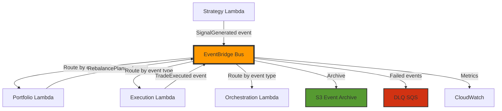

# 🚀 Feature: Migrate to Amazon EventBridge for Event-Driven Architecture

## 📋 Summary

Replace the current in-memory `EventBus` implementation with **Amazon EventBridge** to enable distributed, durable, and scalable event-driven architecture for the Alchemiser trading system.

## 🎯 Problem Statement

### Current State: In-Memory Event Bus

The system currently uses an in-memory event bus (`the_alchemiser/shared/events/bus.py`) with these characteristics:

**Limitations:**
- ❌ **No durability**: Events are lost on Lambda timeout/crash
- ❌ **No replay capability**: Cannot reprocess failed workflows
- ❌ **No observability**: Limited event tracing across components
- ❌ **Synchronous execution**: Blocking operations slow down workflow
- ❌ **No dead-letter queue**: Failed events are lost without retry
- ❌ **Single process only**: Cannot scale horizontally
- ❌ **No event history**: Cannot audit past events for compliance

**Current Event Flow:**
```
Lambda invocation (5-15 min timeout)
  └─> In-memory EventBus
      ├─> SignalGenerated → Portfolio handler (synchronous)
      ├─> RebalancePlanned → Execution handler (synchronous)
      └─> TradeExecuted → Orchestrator (synchronous)
```

**Risk Scenario:**
1. Strategy generates signals (1 min)
2. Portfolio creates rebalance plan (30 sec)
3. **Lambda timeout at 14:30 during order execution** ⚠️
4. All event state lost - no retry mechanism
5. Partial trades may be executed without completion tracking

---

## 🎨 Proposed Solution: Amazon EventBridge

### Why EventBridge over SQS?

| Feature | EventBridge | SQS | Recommendation |
|---------|-------------|-----|----------------|
| **Event routing** | ✅ Rule-based filtering | ❌ Manual polling | **EventBridge** |
| **Schema registry** | ✅ Built-in | ❌ Manual | **EventBridge** |
| **Event replay** | ✅ Event archive & replay | ⚠️ Limited (DLQ only) | **EventBridge** |
| **Fan-out patterns** | ✅ Native | ⚠️ Requires SNS | **EventBridge** |
| **Event history** | ✅ CloudWatch integration | ❌ Not built-in | **EventBridge** |
| **Filtering** | ✅ Content-based | ❌ Message attributes only | **EventBridge** |
| **Cost for low volume** | ✅ $1/million events | ✅ $0.40/million | **EventBridge** (richer features) |
| **Lambda integration** | ✅ Native async invoke | ✅ Native | **Tie** |
| **Ordering** | ⚠️ Best-effort | ✅ FIFO queues | **Neutral** (not critical for us) |

**Verdict:** **EventBridge** is superior for event-driven architectures with complex routing, observability, and replay requirements.

### Target Architecture



### Key Benefits

1. **Durability & Reliability**
   - Events persisted to EventBridge before processing
   - Automatic retry with exponential backoff (up to 185 times over 24 hours)
   - Dead-letter queue for permanently failed events

2. **Async Execution**
   - Handlers invoked asynchronously → no blocking
   - Each module can have independent Lambda timeout
   - Strategy Lambda can complete in 2 min while execution runs for 15 min

3. **Observability**
   - Every event logged to CloudWatch with full trace
   - X-Ray integration for end-to-end workflow tracing
   - Event history for auditing and compliance

4. **Replay & Recovery**
   - Archive events to S3 (retention: 365 days configurable)
   - Replay past events for:
     - Testing new handler versions
     - Recovering from bugs
     - Reprocessing failed workflows

5. **Scalability**
   - Horizontal scaling: Multiple Lambda instances per handler
   - Rate limiting per target (prevent API throttling)
   - Automatic load balancing

6. **Cost Efficiency**
   - ~100-200 events per day = **$0.01-0.02/month**
   - S3 archive storage: **$0.023/GB/month**
   - No idle cost (unlike RDS, ECS)

---

## 🏗️ Implementation Plan

### Phase 1: EventBridge Infrastructure (1-2 days)

**1.1 Create EventBridge Bus**
```yaml
# template.yaml addition
Resources:
  AlchemiserEventBus:
    Type: AWS::Events::EventBus
    Properties:
      Name: alchemiser-trading-events
      Description: Event bus for Alchemiser trading system
      Tags:
        - Key: Environment
          Value: !Ref Environment
        - Key: Project
          Value: Alchemiser

  EventBusPolicy:
    Type: AWS::Events::EventBusPolicy
    Properties:
      EventBusName: !Ref AlchemiserEventBus
      StatementId: AllowSameAccountPublish
      Statement:
        Effect: Allow
        Principal:
          AWS: !Sub 'arn:aws:iam::${AWS::AccountId}:root'
        Action: events:PutEvents
        Resource: !GetAtt AlchemiserEventBus.Arn
```

**1.2 Event Archive for Replay**
```yaml
  EventArchive:
    Type: AWS::Events::Archive
    Properties:
      ArchiveName: alchemiser-event-archive
      SourceArn: !GetAtt AlchemiserEventBus.Arn
      Description: Archive for event replay and audit
      RetentionDays: 365
      EventPattern:
        source:
          - prefix: "alchemiser."
```

**1.3 Dead Letter Queue**
```yaml
  EventDLQ:
    Type: AWS::SQS::Queue
    Properties:
      QueueName: alchemiser-event-dlq
      MessageRetentionPeriod: 1209600  # 14 days
      Tags:
        - Key: Purpose
          Value: DeadLetterQueue
```

**1.4 Event Rules for Each Handler**
```yaml
  # Route SignalGenerated to Portfolio Lambda
  SignalGeneratedRule:
    Type: AWS::Events::Rule
    Properties:
      Name: alchemiser-signal-generated
      EventBusName: !Ref AlchemiserEventBus
      EventPattern:
        source:
          - alchemiser.strategy
        detail-type:
          - SignalGenerated
      Targets:
        - Arn: !GetAtt PortfolioLambda.Arn
          Id: PortfolioHandler
          RetryPolicy:
            MaximumRetryAttempts: 3
            MaximumEventAge: 3600
          DeadLetterConfig:
            Arn: !GetAtt EventDLQ.Arn

  # Route RebalancePlanned to Execution Lambda
  RebalancePlannedRule:
    Type: AWS::Events::Rule
    Properties:
      Name: alchemiser-rebalance-planned
      EventBusName: !Ref AlchemiserEventBus
      EventPattern:
        source:
          - alchemiser.portfolio
        detail-type:
          - RebalancePlanned
      Targets:
        - Arn: !GetAtt ExecutionLambda.Arn
          Id: ExecutionHandler
          RetryPolicy:
            MaximumRetryAttempts: 3
            MaximumEventAge: 3600
          DeadLetterConfig:
            Arn: !GetAtt EventDLQ.Arn

  # Route all events to Orchestrator for monitoring
  AllEventsToOrchestratorRule:
    Type: AWS::Events::Rule
    Properties:
      Name: alchemiser-all-events-to-orchestrator
      EventBusName: !Ref AlchemiserEventBus
      EventPattern:
        source:
          - prefix: "alchemiser."
      Targets:
        - Arn: !GetAtt OrchestratorLambda.Arn
          Id: OrchestratorMonitor
```

---

### Phase 2: EventBridge Adapter (2-3 days)

**2.1 Create EventBridge Client**
```python
# the_alchemiser/shared/events/eventbridge_bus.py
"""Amazon EventBridge implementation of EventBus."""

import json
from datetime import UTC, datetime
from typing import Any

import boto3
from botocore.exceptions import ClientError

from the_alchemiser.shared.logging import get_logger
from .base import BaseEvent
from .bus import EventBus, EventHandler

logger = get_logger(__name__)


class EventBridgeBus(EventBus):
    """EventBus implementation using Amazon EventBridge.
    
    Provides durable, async, distributed event routing with:
    - Event persistence and replay
    - Automatic retries with exponential backoff
    - Dead-letter queue for failed events
    - CloudWatch observability
    """

    def __init__(
        self,
        event_bus_name: str = "alchemiser-trading-events",
        source_prefix: str = "alchemiser",
        *,
        enable_local_handlers: bool = False,
    ) -> None:
        """Initialize EventBridge bus.
        
        Args:
            event_bus_name: Name of the EventBridge event bus
            source_prefix: Prefix for event sources (e.g., "alchemiser.strategy")
            enable_local_handlers: If True, keep in-memory handlers for testing
        """
        super().__init__()
        self.event_bus_name = event_bus_name
        self.source_prefix = source_prefix
        self.enable_local_handlers = enable_local_handlers
        
        # Initialize EventBridge client
        self.events_client = boto3.client("events")
        
        logger.info(
            "EventBridgeBus initialized",
            event_bus_name=event_bus_name,
            source_prefix=source_prefix,
        )

    def publish(self, event: BaseEvent) -> None:
        """Publish event to EventBridge.
        
        Args:
            event: Event to publish
            
        Raises:
            Does not raise - logs errors and continues
        """
        try:
            # Determine source based on module
            source = f"{self.source_prefix}.{event.source_module}"
            
            # Serialize event to dict
            event_dict = event.model_dump(mode="json")
            
            # Build EventBridge entry
            entry = {
                "Time": datetime.now(UTC),
                "Source": source,
                "DetailType": event.event_type,
                "Detail": json.dumps(event_dict),
                "EventBusName": self.event_bus_name,
                "Resources": [],
            }
            
            # Add correlation/causation for tracing
            if event.correlation_id:
                entry["Resources"].append(f"correlation:{event.correlation_id}")
            if event.causation_id:
                entry["Resources"].append(f"causation:{event.causation_id}")
            
            # Publish to EventBridge
            response = self.events_client.put_events(Entries=[entry])
            
            # Check for failures
            if response.get("FailedEntryCount", 0) > 0:
                failed = response["Entries"][0]
                logger.error(
                    "Failed to publish event to EventBridge",
                    event_type=event.event_type,
                    error_code=failed.get("ErrorCode"),
                    error_message=failed.get("ErrorMessage"),
                )
            else:
                logger.info(
                    "Event published to EventBridge",
                    event_type=event.event_type,
                    event_id=event.event_id,
                    correlation_id=event.correlation_id,
                    source=source,
                )
            
            # Also trigger local handlers if enabled (for testing/hybrid mode)
            if self.enable_local_handlers:
                super().publish(event)
                
        except ClientError as e:
            logger.error(
                "EventBridge client error",
                error=str(e),
                error_code=e.response.get("Error", {}).get("Code"),
                event_type=event.event_type,
            )
        except Exception as e:
            logger.error(
                "Unexpected error publishing to EventBridge",
                error=str(e),
                error_type=type(e).__name__,
                event_type=event.event_type,
            )

    def subscribe(self, event_type: str, handler: EventHandler) -> None:
        """Subscribe handler to event type.
        
        Note: With EventBridge, subscriptions are managed via CloudFormation
        EventRules, not programmatically. This method is kept for local testing.
        
        Args:
            event_type: Type of event to subscribe to
            handler: Handler instance
        """
        if self.enable_local_handlers:
            super().subscribe(event_type, handler)
            logger.debug(
                "Local handler subscribed (EventBridge rules should also be configured)",
                event_type=event_type,
                handler=type(handler).__name__,
            )
        else:
            logger.warning(
                "subscribe() called on EventBridgeBus - use CloudFormation EventRules instead",
                event_type=event_type,
            )
```

**2.2 Lambda Entry Point for Event Handling**
```python
# the_alchemiser/lambda_handler_eventbridge.py
"""Lambda handler for EventBridge-triggered events."""

import json
from datetime import UTC, datetime

from the_alchemiser.shared.config.container import ApplicationContainer
from the_alchemiser.shared.events import BaseEvent
from the_alchemiser.shared.logging import get_logger

logger = get_logger(__name__)


def eventbridge_handler(event: dict, context: object) -> dict:
    """Handle EventBridge event by routing to appropriate handler.
    
    Args:
        event: EventBridge event payload
        context: Lambda context object
        
    Returns:
        Response dict with statusCode and body
    """
    try:
        # Extract event details from EventBridge payload
        detail_type = event.get("detail-type", "")
        detail = event.get("detail", {})
        source = event.get("source", "")
        
        logger.info(
            "Received EventBridge event",
            detail_type=detail_type,
            source=source,
            event_id=detail.get("event_id"),
        )
        
        # Parse detail as event object
        if isinstance(detail, str):
            detail = json.loads(detail)
        
        # Reconstruct event from detail
        event_class = _get_event_class(detail_type)
        if not event_class:
            logger.warning(f"Unknown event type: {detail_type}")
            return {"statusCode": 400, "body": f"Unknown event type: {detail_type}"}
        
        event_obj = event_class.model_validate(detail)
        
        # Initialize container and get appropriate handler
        container = ApplicationContainer.create_for_environment("production")
        handler = _get_handler_for_event(container, detail_type)
        
        if not handler:
            logger.warning(f"No handler configured for event type: {detail_type}")
            return {"statusCode": 404, "body": f"No handler for: {detail_type}"}
        
        # Invoke handler
        handler.handle_event(event_obj)
        
        logger.info(
            "Event handled successfully",
            detail_type=detail_type,
            event_id=event_obj.event_id,
        )
        
        return {"statusCode": 200, "body": "Event processed successfully"}
        
    except Exception as e:
        logger.error(
            "Failed to handle EventBridge event",
            error=str(e),
            error_type=type(e).__name__,
            exc_info=True,
        )
        # Re-raise to trigger retry
        raise


def _get_event_class(detail_type: str) -> type[BaseEvent] | None:
    """Map detail-type to event class."""
    from the_alchemiser.shared.events import (
        SignalGenerated,
        RebalancePlanned,
        TradeExecuted,
        WorkflowCompleted,
        WorkflowFailed,
    )
    
    event_map = {
        "SignalGenerated": SignalGenerated,
        "RebalancePlanned": RebalancePlanned,
        "TradeExecuted": TradeExecuted,
        "WorkflowCompleted": WorkflowCompleted,
        "WorkflowFailed": WorkflowFailed,
    }
    
    return event_map.get(detail_type)


def _get_handler_for_event(container: ApplicationContainer, detail_type: str) -> Any:
    """Get appropriate handler for event type."""
    # Import handlers
    from the_alchemiser.portfolio_v2.handlers import PortfolioAnalysisHandler
    from the_alchemiser.execution_v2.handlers import TradingExecutionHandler
    
    handler_map = {
        "SignalGenerated": lambda: PortfolioAnalysisHandler(container),
        "RebalancePlanned": lambda: TradingExecutionHandler(container),
        # Orchestrator handles all events for monitoring
        "TradeExecuted": lambda: None,  # Orchestrator only
        "WorkflowCompleted": lambda: None,  # Orchestrator only
        "WorkflowFailed": lambda: None,  # Orchestrator only
    }
    
    factory = handler_map.get(detail_type)
    return factory() if factory else None
```

---

### Phase 3: Gradual Migration (3-5 days)

**3.1 Hybrid Mode**
- Deploy EventBridge infrastructure
- Keep in-memory EventBus as primary
- Enable dual-publishing to both buses
- Monitor EventBridge for correctness

**3.2 Feature Flag Configuration**
```python
# the_alchemiser/shared/config/settings.py

class EventBusSettings(BaseSettings):
    """Event bus configuration."""
    
    # EventBridge settings
    use_eventbridge: bool = Field(
        default=False,
        description="Use EventBridge instead of in-memory bus"
    )
    eventbridge_bus_name: str = Field(
        default="alchemiser-trading-events",
        description="Name of EventBridge event bus"
    )
    enable_dual_publish: bool = Field(
        default=False,
        description="Publish to both in-memory and EventBridge (for testing)"
    )
```

**3.3 Cutover**
- Enable EventBridge in dev environment
- Run full integration tests
- Monitor for 1-2 weeks
- Enable in production
- Remove in-memory bus after 1 month

---

### Phase 4: Advanced Features (Optional, 2-3 days)

**4.1 Event Replay**
```python
# scripts/replay_events.py
"""Replay archived events from S3."""

import boto3
from datetime import datetime, timedelta

def replay_events(start_time: datetime, end_time: datetime, event_pattern: dict):
    """Replay events from archive."""
    events = boto3.client("events")
    
    response = events.start_replay(
        ReplayName=f"replay-{datetime.now().isoformat()}",
        EventSourceArn=f"arn:aws:events:us-east-1:123456789012:archive/alchemiser-event-archive",
        EventStartTime=start_time,
        EventEndTime=end_time,
        Destination={
            "Arn": "arn:aws:events:us-east-1:123456789012:event-bus/alchemiser-trading-events"
        },
    )
    
    print(f"Replay started: {response['ReplayArn']}")
```

**4.2 Event Transformation (Content-based routing)**
```yaml
  # Only route high-value trades to execution
  HighValueTradesRule:
    Type: AWS::Events::Rule
    Properties:
      EventPattern:
        source:
          - alchemiser.portfolio
        detail-type:
          - RebalancePlanned
        detail:
          total_trade_value:
            - numeric: [">", 10000]
      Targets:
        - Arn: !GetAtt ExecutionLambda.Arn
```

**4.3 Schema Registry**
```yaml
  EventSchema:
    Type: AWS::EventSchemas::Schema
    Properties:
      RegistryName: alchemiser-trading
      SchemaName: SignalGenerated
      Type: OpenApi3
      Content: |
        {
          "openapi": "3.0.0",
          "info": {"version": "1.0.0", "title": "SignalGenerated"},
          "paths": {},
          "components": {
            "schemas": {
              "SignalGenerated": {
                "type": "object",
                "required": ["event_id", "correlation_id", "timestamp"],
                "properties": {
                  "event_id": {"type": "string"},
                  "correlation_id": {"type": "string"},
                  "timestamp": {"type": "string", "format": "date-time"}
                }
              }
            }
          }
        }
```

---

## 🧪 Testing Strategy

### 1. Local Testing (with LocalStack)
```bash
# docker-compose.yml
services:
  localstack:
    image: localstack/localstack
    ports:
      - "4566:4566"
    environment:
      - SERVICES=events,sqs,s3
      - DEBUG=1
    volumes:
      - "./localstack-data:/tmp/localstack"
```

### 2. Integration Tests
```python
# tests/integration/test_eventbridge_workflow.py

def test_full_workflow_via_eventbridge(eventbridge_bus):
    """Test complete workflow through EventBridge."""
    # Publish SignalGenerated
    signal_event = SignalGenerated(...)
    eventbridge_bus.publish(signal_event)
    
    # Wait for workflow completion (check DynamoDB or SQS)
    result = wait_for_workflow_completion(signal_event.correlation_id, timeout=60)
    
    assert result.success
    assert result.orders_executed > 0
```

### 3. Chaos Testing
- Simulate Lambda timeouts during execution
- Verify event replay recovers state
- Test DLQ handling for permanently failed events

---

## 📊 Observability & Monitoring

### CloudWatch Dashboards
```yaml
  EventBridgeDashboard:
    Type: AWS::CloudWatch::Dashboard
    Properties:
      DashboardName: Alchemiser-EventBridge
      DashboardBody: |
        {
          "widgets": [
            {
              "type": "metric",
              "properties": {
                "metrics": [
                  ["AWS/Events", "Invocations", {"stat": "Sum"}],
                  [".", "FailedInvocations", {"stat": "Sum"}],
                  [".", "ThrottledRules", {"stat": "Sum"}]
                ],
                "period": 300,
                "stat": "Sum",
                "region": "us-east-1",
                "title": "EventBridge Metrics"
              }
            }
          ]
        }
```

### Alarms
```yaml
  HighDLQMessagesAlarm:
    Type: AWS::CloudWatch::Alarm
    Properties:
      AlarmName: Alchemiser-EventBridge-HighDLQ
      MetricName: ApproximateNumberOfMessagesVisible
      Namespace: AWS/SQS
      Statistic: Average
      Period: 300
      EvaluationPeriods: 1
      Threshold: 5
      ComparisonOperator: GreaterThanThreshold
      Dimensions:
        - Name: QueueName
          Value: !GetAtt EventDLQ.QueueName
      AlarmActions:
        - !Ref AlertTopic
```

---

## 💰 Cost Estimate

**Monthly Cost (assuming 100 events/day, 3000 events/month):**

| Service | Usage | Unit Cost | Monthly Cost |
|---------|-------|-----------|--------------|
| EventBridge | 3,000 events | $1 per 1M events | **$0.003** |
| Lambda invocations | 3,000 invocations | $0.20 per 1M | **$0.0006** |
| Lambda compute (avg 3s each) | 9,000 GB-sec | $0.0000166667 per GB-sec | **$0.15** |
| S3 archive (1 GB/month) | 1 GB storage | $0.023 per GB | **$0.023** |
| CloudWatch Logs (500 MB) | 500 MB storage | $0.50 per GB | **$0.25** |
| **Total** | | | **~$0.43/month** |

**Annual Cost:** ~**$5.16/year** (negligible!)

---

## ✅ Acceptance Criteria

- [ ] EventBridge event bus deployed in AWS
- [ ] Event rules configured for all event types
- [ ] Dead-letter queue configured with monitoring
- [ ] Event archive enabled with 365-day retention
- [ ] `EventBridgeBus` class implements `EventBus` interface
- [ ] Dual-publish mode functional for hybrid testing
- [ ] Feature flag controls in-memory vs EventBridge
- [ ] Lambda handlers receive and process EventBridge events
- [ ] Full integration test passes using EventBridge
- [ ] CloudWatch dashboard shows event metrics
- [ ] DLQ alarm triggers on failures
- [ ] Documentation updated with EventBridge architecture
- [ ] Runbook created for event replay scenarios

---

## 📚 References

- [Amazon EventBridge Documentation](https://docs.aws.amazon.com/eventbridge/)
- [EventBridge Best Practices](https://docs.aws.amazon.com/eventbridge/latest/userguide/eb-best-practices.html)
- [Event-Driven Architecture Patterns](https://aws.amazon.com/event-driven-architecture/)
- [EventBridge vs SQS Comparison](https://aws.amazon.com/blogs/compute/choosing-between-messaging-services-for-serverless-applications/)

---

## 🏷️ Labels

`enhancement` `infrastructure` `aws` `eventbridge` `async` `durability` `observability` `architecture`

---

## 📋 Checklist for Implementer

- [ ] Read EventBridge documentation
- [ ] Review current event schemas in `shared/events/schemas.py`
- [ ] Set up LocalStack for local testing
- [ ] Create CloudFormation resources in `template.yaml`
- [ ] Implement `EventBridgeBus` class
- [ ] Add feature flag to config
- [ ] Update Lambda handlers to support EventBridge payloads
- [ ] Write integration tests
- [ ] Deploy to dev environment
- [ ] Monitor for 1 week
- [ ] Deploy to production
- [ ] Remove in-memory bus (after 1 month buffer)
