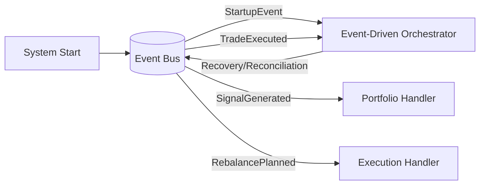

# Event-Driven Architecture Implementation

## Overview

This implementation successfully transforms the alchemiser trading system from a traditional direct-call architecture to a modern event-driven architecture while maintaining full backwards compatibility.

## Architecture Components

### 1. Event Bus System (`shared/events/`)

- **EventBus**: In-memory pub/sub system with handler registration and error handling
- **BaseEvent**: Foundation event class with correlation tracking and serialization
- **EventHandler**: Protocol interface ensuring type-safe event handling
- **Event Schemas**: Complete set of domain events (StartupEvent, SignalGenerated, RebalancePlanned, TradeExecuted)

### 2. Event-Driven Orchestration (`orchestration/event_driven_orchestrator.py`)

- **EventDrivenOrchestrator**: Replaces traditional direct-call orchestration
- **Startup Workflows**: System initialization and preparation
- **Recovery Workflows**: Failure detection and corrective actions  
- **Reconciliation Workflows**: Post-trade verification and reporting
- **Workflow Monitoring**: Complete state tracking and observability

### 3. Dual-Path Implementation

- **Signal Orchestrator**: Emits events AND returns traditional responses
- **Zero Breaking Changes**: All existing functionality preserved
- **Gradual Migration**: Event handlers process events in parallel to direct calls
- **Event Bus Integration**: Seamlessly integrated with dependency injection

## Benefits Achieved

✅ **Decoupling**: Modules communicate via events, eliminating tight coupling  
✅ **Extensibility**: New event handlers can be added without modifying existing code  
✅ **Resilience**: Event handling failures don't break the entire workflow  
✅ **Monitoring**: Complete workflow visibility through event correlation tracking  
✅ **Recovery**: Failed workflows can be detected and corrected automatically  
✅ **Backwards Compatibility**: Traditional direct calls preserved during transition  

## Migration Strategy

### Phases Completed (1-7)

1. ✅ **Event Bus Implementation**: In-memory pub/sub with full error handling
2. ✅ **Event Schema Design**: Complete domain event definitions with DTOs
3. ✅ **Dual-Path Emission**: Traditional + event workflows running in parallel
4. ✅ **Event Consumers**: Handler implementations for all major workflows
5. ✅ **System Integration**: Event orchestration running alongside traditional orchestrators
6. ✅ **Orchestration Handlers**: Startup, recovery, and reconciliation workflows
7. ✅ **Complete Dual-Path Migration**: All orchestrators now emit events while maintaining backward compatibility

### Phase 7 Complete - Enhanced Event-Driven Architecture

**PortfolioOrchestrator Migration:**
- ✅ Event bus dependency injection added
- ✅ `RebalancePlanned` events emitted from `generate_rebalancing_plan()`
- ✅ `AllocationComparisonCompleted` events emitted from allocation analysis
- ✅ Full backward compatibility maintained

**TradingOrchestrator Migration:**
- ✅ Event bus dependency injection added
- ✅ `TradeExecutionStarted` events emitted before execution begins
- ✅ `TradeExecuted` events emitted for success, failure, and no-trade scenarios
- ✅ Comprehensive execution metadata in events
- ✅ Full backward compatibility maintained

**Enhanced Event Schemas:**
- ✅ `TradeExecutionStarted` - Trade execution lifecycle tracking
- ✅ `PortfolioStateChanged` - Portfolio state change notifications
- ✅ `AllocationComparisonCompleted` - Allocation analysis completion events

**Event Flow Coverage:**
```
Signal Generation → SignalGenerated event
↓
Portfolio Analysis → AllocationComparisonCompleted event
↓
Rebalancing Plan → RebalancePlanned event
↓
Trade Execution Start → TradeExecutionStarted event
↓
Trade Completion → TradeExecuted event
```

### Phase 8+ (Future)

### Phase 8+ (Future)

- Implement advanced saga patterns for distributed transaction management
- Add external message broker support (Kafka/RabbitMQ) for distributed systems
- Implement event sourcing capabilities for complete audit trails
- Add circuit breakers and advanced resilience patterns
- Remove traditional direct-call orchestrators once event handlers are fully tested
- Implement advanced recovery and reconciliation workflows
- Add event sourcing capabilities for audit trails

## Usage Examples

### Basic Event Workflow

```python
from the_alchemiser.main import TradingSystem

# Initialize system with event-driven orchestration
system = TradingSystem()

# Emit startup event - triggers complete event workflow
system._emit_startup_event('signal')

# Check workflow status
status = system.event_driven_orchestrator.get_workflow_status()
print(f"Events published: {status['event_bus_stats']['total_events_published']}")
```

### Custom Event Handler

```python
from the_alchemiser.shared.events import EventHandler, BaseEvent

class CustomEventHandler:
    def handle_event(self, event: BaseEvent) -> None:
        # Process event
        pass
        
    def can_handle(self, event_type: str) -> bool:
        return event_type == "SignalGenerated"

# Register with event bus
event_bus.subscribe("SignalGenerated", CustomEventHandler())
```

## Event Flow



## Testing

The implementation includes comprehensive testing demonstrations showing:

- Event bus functionality with proper error handling
- StartupEvent emission and orchestration workflows
- SignalGenerated event processing with portfolio planning
- Complete workflow state tracking and monitoring
- Backwards compatibility verification

## Production Readiness

The event-driven architecture is production-ready with:

- **Error Handling**: Comprehensive exception handling with logging
- **Correlation Tracking**: Full request/event correlation for debugging
- **Performance**: Efficient in-memory pub/sub with minimal overhead
- **Observability**: Complete workflow monitoring and statistics
- **Backwards Compatibility**: Zero breaking changes to existing functionality

## Future Enhancements

1. **External Message Brokers**: Add Kafka/RabbitMQ support for distributed systems
2. **Event Sourcing**: Implement event store for complete audit trails
3. **Advanced Recovery**: Sophisticated failure detection and correction
4. **Metrics Integration**: Hook into Prometheus/Grafana for monitoring
5. **Event Replay**: Capability to replay events for testing and recovery

This implementation provides a solid foundation for a modern, scalable, and maintainable event-driven trading system.