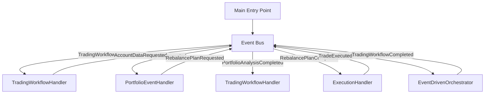

# Event-Driven Orchestration Migration Plan

## Current State Analysis

### Event-Driven Components (✅ Already Implemented)
The system has successfully implemented a solid event-driven foundation:

- **Event Bus System** (`shared/events/`): In-memory pub/sub with handler registration and error handling
- **Event Schemas**: Complete set of domain events (StartupEvent, SignalGenerated, RebalancePlanned, TradeExecuted)
- **EventDrivenOrchestrator**: Handles startup, recovery, and reconciliation workflows via events
- **Dual-Path Emission**: SignalOrchestrator emits SignalGenerated events while maintaining traditional return values
- **Event Infrastructure**: Correlation tracking, error handling, and monitoring

### Non-Event-Driven Components (❌ Need Migration)

#### 1. TradingOrchestrator Direct Dependencies
**Current Pattern:**
```python
class TradingOrchestrator:
    def __init__(self, ...):
        # Direct instantiation of other orchestrators
        self.signal_orchestrator = SignalOrchestrator(settings, container)
        self.portfolio_orchestrator = PortfolioOrchestrator(settings, container)
        
    def _execute_strategy_signals_internal(self, ...):
        # Direct method calls
        strategy_signals, consolidated_portfolio_dto = self.signal_orchestrator.generate_signals()
        account_data = self.portfolio_orchestrator.get_comprehensive_account_data()
        allocation_comparison = self.portfolio_orchestrator.analyze_allocation_comparison(...)
```

**Problems:**
- Tight coupling between orchestrators
- Synchronous blocking workflow
- No event correlation tracking
- Single point of failure for entire workflow
- Difficult to test individual components

#### 2. Portfolio Orchestration Not Event-Driven
**Current Pattern:**
```python
class PortfolioOrchestrator:
    def analyze_portfolio_state(self) -> dict[str, Any] | None:
        # Direct return of analysis results
        
    def generate_rebalancing_plan(self, target_allocations) -> dict[str, Any] | None:
        # Direct return of rebalancing plan
```

**Problems:**
- No event emission for portfolio analysis completion
- Blocking synchronous execution
- Results not available to other event-driven components
- No correlation with upstream signal events

#### 3. Main Entry Points Not Fully Event-Driven
**Current Pattern:**
```python
class TradingSystem:
    def analyze_signals(self) -> bool:
        # Uses SignalAnalyzer which creates its own orchestrators
        
    def execute_trading(self) -> bool:
        # Uses TradingExecutor which creates TradingOrchestrator
```

**Problems:**
- CLI creates new orchestrator instances instead of using event bus
- No event coordination between signal analysis and trading execution
- Event emission happens alongside traditional execution, not replacing it

### Gap Analysis

#### Missing Event Types
1. **PortfolioAnalysisRequested**: Request portfolio state analysis
2. **PortfolioAnalysisCompleted**: Portfolio analysis results
3. **RebalancePlanRequested**: Request rebalancing plan generation
4. **RebalancePlanCompleted**: Rebalancing plan ready (different from RebalancePlanned)
5. **TradingWorkflowRequested**: Request full trading workflow execution
6. **TradingWorkflowCompleted**: Trading workflow finished
7. **AccountDataRequested**: Request comprehensive account data
8. **AccountDataRetrieved**: Account data available

#### Missing Event Handlers
1. **PortfolioEventHandler**: Handle portfolio-related events
2. **TradingWorkflowHandler**: Coordinate full trading workflows via events
3. **AccountDataHandler**: Handle account data requests and responses

#### Missing Event Flows
1. **Signal → Portfolio → Execution Pipeline**: No event chain from signal generation to trade execution
2. **Error Recovery**: No event-driven error handling and recovery workflows
3. **Workflow Coordination**: No event-based coordination between major workflow phases

## Target Event-Driven Design

### Event Flow Architecture


### New Event Types Needed

#### 1. TradingWorkflowRequested
```python
class TradingWorkflowRequested(BaseEvent):
    event_type: str = "TradingWorkflowRequested"
    workflow_mode: str  # "signal_only" or "full_trading"
    ignore_market_hours: bool = False
    execution_parameters: dict[str, Any] | None = None
```

#### 2. PortfolioAnalysisRequested
```python
class PortfolioAnalysisRequested(BaseEvent):
    event_type: str = "PortfolioAnalysisRequested"
    trigger_event_id: str  # ID of SignalGenerated event that triggered this
    target_allocations: dict[str, Decimal] | None = None
```

#### 3. PortfolioAnalysisCompleted
```python
class PortfolioAnalysisCompleted(BaseEvent):
    event_type: str = "PortfolioAnalysisCompleted"
    portfolio_state: PortfolioStateDTO
    allocation_comparison: AllocationComparisonDTO | None = None
    account_data: dict[str, Any]
    analysis_timestamp: datetime
```

#### 4. RebalancePlanRequested
```python
class RebalancePlanRequested(BaseEvent):
    event_type: str = "RebalancePlanRequested"
    target_allocations: ConsolidatedPortfolioDTO
    portfolio_state: PortfolioStateDTO
    trigger_signal_id: str
```

#### 5. TradingWorkflowCompleted
```python
class TradingWorkflowCompleted(BaseEvent):
    event_type: str = "TradingWorkflowCompleted"
    workflow_id: str
    success: bool
    results: dict[str, Any]
    error_message: str | None = None
```

### New Event Handlers Needed

#### 1. TradingWorkflowHandler
```python
class TradingWorkflowHandler:
    """Coordinates full trading workflows via events."""
    
    def handle_trading_workflow_requested(self, event: TradingWorkflowRequested) -> None:
        # Emit SignalGenerated request or use existing signals
        # Track workflow state
        
    def handle_signal_generated(self, event: SignalGenerated) -> None:
        # Emit PortfolioAnalysisRequested
        
    def handle_portfolio_analysis_completed(self, event: PortfolioAnalysisCompleted) -> None:
        # Emit RebalancePlanRequested if needed
        
    def handle_rebalance_plan_completed(self, event: RebalancePlanned) -> None:
        # Emit trade execution requests if in trading mode
        
    def handle_trade_executed(self, event: TradeExecuted) -> None:
        # Check if workflow is complete, emit TradingWorkflowCompleted
```

#### 2. PortfolioEventHandler
```python
class PortfolioEventHandler:
    """Handles portfolio-related event workflows."""
    
    def handle_portfolio_analysis_requested(self, event: PortfolioAnalysisRequested) -> None:
        # Execute portfolio analysis
        # Emit PortfolioAnalysisCompleted
        
    def handle_rebalance_plan_requested(self, event: RebalancePlanRequested) -> None:
        # Generate rebalancing plan
        # Emit RebalancePlanned
```

## Migration Strategy

### Phase 1: Create New Event Types and Handlers (Week 1)
1. **Add new event schemas** to `shared/events/schemas.py`
2. **Implement PortfolioEventHandler** with portfolio analysis logic
3. **Implement TradingWorkflowHandler** for workflow coordination
4. **Register new handlers** with the event bus
5. **Add comprehensive logging** and correlation tracking

### Phase 2: Convert Portfolio Orchestrator (Week 2)
1. **Update PortfolioOrchestrator** to emit events instead of direct returns
2. **Maintain dual-path** for backwards compatibility
3. **Add event-driven portfolio workflows** alongside existing methods
4. **Test event flow** for portfolio analysis and rebalancing

### Phase 3: Convert Trading Orchestrator (Week 3)
1. **Replace direct orchestrator calls** with event emissions in TradingOrchestrator
2. **Implement event-driven trading workflow** coordination
3. **Add workflow state tracking** via events
4. **Maintain traditional return values** for CLI compatibility

### Phase 4: Update Entry Points (Week 4)
1. **Modify TradingExecutor** to emit TradingWorkflowRequested events
2. **Update SignalAnalyzer** to use event-driven signal workflows
3. **Add event-based result collection** for CLI display
4. **Ensure backwards compatibility** with existing APIs

### Phase 5: Remove Traditional Orchestrator Coupling (Week 5)
1. **Remove direct orchestrator instantiation** in TradingOrchestrator
2. **Remove synchronous method calls** between orchestrators
3. **Convert all workflows** to pure event-driven execution
4. **Add comprehensive integration testing**

### Phase 6: Cleanup and Optimization (Week 6)
1. **Remove dual-path emission** code (keep only event-driven paths)
2. **Optimize event handler performance**
3. **Add advanced workflow monitoring**
4. **Complete documentation** and examples

## Risk Mitigation

### Backwards Compatibility
- **Dual-Path Execution**: Maintain existing return values while adding event emission
- **Gradual Migration**: Convert one orchestrator at a time
- **Feature Flags**: Allow switching between traditional and event-driven modes

### Error Handling
- **Event Handler Failures**: Don't break traditional workflows during transition
- **Correlation Tracking**: Maintain full event correlation for debugging
- **Recovery Workflows**: Add event-driven error recovery mechanisms

### Performance
- **In-Memory Event Bus**: Minimal overhead for synchronous event handling
- **Batched Events**: Avoid excessive event emissions for related operations
- **Monitoring**: Track event processing performance and bottlenecks

### Testing
- **Unit Tests**: Each event handler independently testable
- **Integration Tests**: Full workflow testing via event emissions
- **Compatibility Tests**: Ensure traditional APIs still work during migration

## Implementation Notes

### Event Ordering
- Use correlation IDs to track related events across the workflow
- Implement workflow state machines to handle out-of-order events
- Add event timestamps for ordering guarantees

### Idempotency
- Make all event handlers idempotent to handle duplicate events
- Use event IDs to detect and skip duplicate processing
- Implement proper cleanup for failed workflow events

### Monitoring
- Add event bus metrics (events published/processed, handler performance)
- Implement workflow tracking dashboards
- Add alerting for failed event processing

### Future Extensibility
- Design event schemas for easy extension without breaking changes
- Use event versioning for backwards compatibility
- Plan for external message broker integration (Kafka/RabbitMQ)

This migration plan provides a clear path to fully event-driven orchestration while maintaining system stability and backwards compatibility throughout the transition.