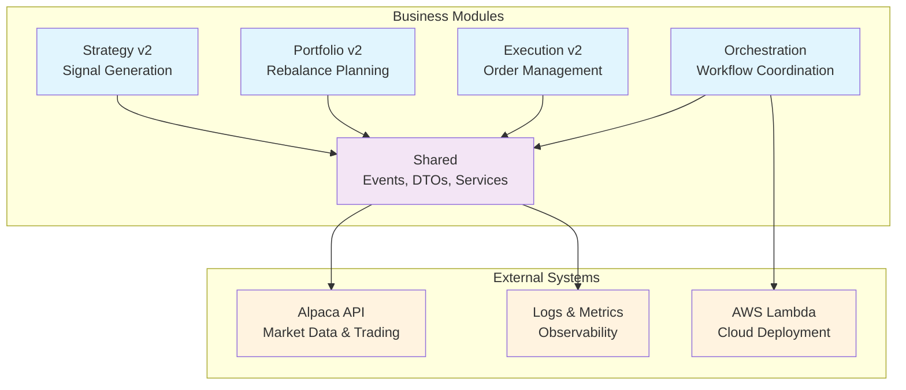
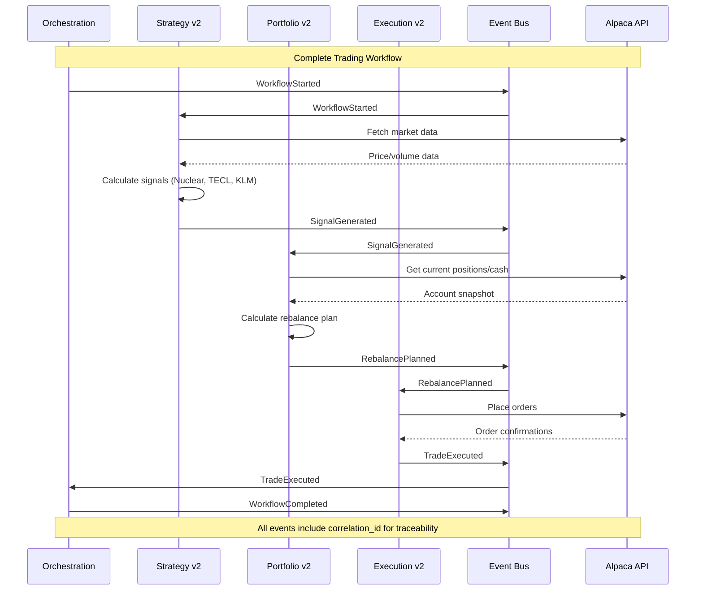

# The Alchemiser

A multi-strategy quantitative trading system built on event-driven architecture. Combines multiple quantitative strategies (KMLM, Nuclear, and others) into a single, resilient execution engine with strict module boundaries and end-to-end traceability.

## System Architecture

The Alchemiser is organized into five key business modules communicating exclusively through events:



### Module Boundaries

- **Strategy v2**: Generates trading signals from market data
- **Portfolio v2**: Converts signals into rebalance plans
- **Execution v2**: Executes trades via Alpaca broker
- **Orchestration**: Coordinates workflows through event handlers
- **Shared**: Common DTOs, events, adapters, and utilities

**Critical Constraint**: Business modules only import from `shared/`. No cross-module dependencies allowed.

## Event-Driven Workflow

The system operates through a pure event-driven architecture with idempotent, traceable workflows:



## Event Types and Schemas

All events extend `BaseEvent` with correlation tracking and metadata:

### Core Workflow Events

| Event | Publisher | Consumer | Schema |
|-------|-----------|----------|---------|
| `WorkflowStarted` | Orchestration | Strategy v2 | `workflow_type`, `requested_by`, `configuration` |
| `SignalGenerated` | Strategy v2 | Portfolio v2 | `signals_data`, `consolidated_portfolio`, `signal_count` |
| `RebalancePlanned` | Portfolio v2 | Execution v2 | `rebalance_plan`, `allocation_comparison`, `trades_required` |
| `TradeExecuted` | Execution v2 | Orchestration | `execution_data`, `orders_placed`, `orders_succeeded` |
| `WorkflowCompleted` | Orchestration | System | `workflow_type`, `success`, `summary` |

### Additional Events

- `StartupEvent`: System initialization trigger
- `WorkflowFailed`: Error handling and recovery
- `ExecutionPhaseCompleted`: Multi-phase trade coordination
- `PortfolioStateChanged`: Position/balance updates

All events include:
- `correlation_id`: End-to-end workflow tracking
- `causation_id`: Parent event reference
- `event_id`: Unique event identifier
- `timestamp`: Event creation time
- `source_module`/`source_component`: Event origin

## Business Module Details

### Strategy v2 (`strategy_v2/`)

**Purpose**: Generate trading signals from market data using multiple quantitative strategies.

**Inputs**: Market data via shared Alpaca adapters
**Outputs**: `SignalGenerated` events with strategy allocations

**Key Components**:
- `engines/`: Strategy implementations (Nuclear, TECL, KLM)
- `indicators/`: Technical indicator calculations
- `handlers/`: Event handlers for signal generation
- `adapters/`: Market data access layer

**Boundaries**: No portfolio sizing or execution concerns. Pure signal generation only.

### Portfolio v2 (`portfolio_v2/`)

**Purpose**: Convert strategy signals into executable rebalance plans.

**Inputs**: `SignalGenerated` events
**Outputs**: `RebalancePlanned` events with trade specifications

**Key Components**:
- `core/planner.py`: Rebalance plan calculator
- `core/state_reader.py`: Portfolio snapshot builder
- `adapters/`: Account data access
- `handlers/`: Event handlers for portfolio analysis

**Boundaries**: No order placement or execution logic. Focuses on BUY/SELL/HOLD decisions with trade amounts.

### Execution v2 (`execution_v2/`)

**Purpose**: Execute trades through broker API with proper safeguards.

**Inputs**: `RebalancePlanned` events
**Outputs**: `TradeExecuted` events with execution results

**Key Components**:
- `core/execution_manager.py`: Order placement coordination
- `handlers/`: Event handlers for trade execution
- `models/`: Execution result DTOs

**Boundaries**: No recalculation of plans. Pure order execution with slippage controls.

### Orchestration (`orchestration/`)

**Purpose**: Coordinate complete workflows and handle cross-cutting concerns.

**Key Components**:
- `event_driven_orchestrator.py`: Primary workflow coordinator
- `system.py`: System bootstrap and configuration

**Responsibilities**: Workflow state tracking, error handling, notifications, and recovery.

### Shared (`shared/`)

**Purpose**: Common services, DTOs, and protocols used across modules.

**Key Components**:
- `events/`: Event bus, schemas, and handlers
- `schemas/`: DTOs for data exchange
- `adapters/`: External service integrations (Alpaca)
- `config/`: Dependency injection container
- `logging/`: Structured logging utilities

## Developer Workflow

### Setup

```bash
# Install with Poetry (recommended)
poetry install --with dev

# Or with pip
pip install -e .
```

### Development Commands

```bash
# Run trading locally (paper mode)
poetry run python -m the_alchemiser

# Format and lint
make format
make lint
make type-check

# Check module boundaries
make import-check

# Full validation suite
make migration-check
```

### Testing

```bash
# Run full test suite
pytest

# Test specific modules
pytest tests/strategy_v2/
pytest tests/portfolio_v2/
pytest tests/execution_v2/
```

## Configuration

### Environment Variables

```bash
# Required for live trading
ALPACA_API_KEY=your_api_key
ALPACA_SECRET_KEY=your_secret_key
ALPACA_BASE_URL=https://api.alpaca.markets  # or https://paper-api.alpaca.markets

# Optional
LOG_LEVEL=INFO
PAPER_TRADING=true  # Default for local runs
```

### AWS Deployment

#### Production & Dev Deployments

```bash
# Deploy to dev (creates beta tag)
make deploy-dev

# Deploy to production (creates release tag)
make deploy-prod

# Or use the deprecated direct deploy
make deploy
```

#### Ephemeral Deployments (Feature Branch Testing)

Deploy any feature branch as an isolated, temporary stack:

```bash
# Deploy ephemeral stack with 24-hour TTL
make deploy-ephemeral BRANCH=feature/my-feature TTL_HOURS=24

# List active ephemeral stacks
make list-ephemeral

# Destroy when done testing
make destroy-ephemeral STACK=alchemiser-ephem-feature-my-feature-a1b2c3d
```

Ephemeral stacks are:
- Fully isolated from dev/prod
- Automatically cleaned up after TTL expires
- Ideal for realistic testing of infrastructure changes

📖 **[Full Ephemeral Deployments Documentation](docs/EPHEMERAL_DEPLOYMENTS.md)**

For CI/CD details, see **[DEPLOYMENT_WORKFLOW.md](docs/DEPLOYMENT_WORKFLOW.md)**

## Observability

### Structured Logging

All events and operations include structured metadata:

```json
{
  "timestamp": "2024-01-15T10:30:00Z",
  "level": "INFO",
  "correlation_id": "wf-123e4567-e89b-12d3",
  "event_type": "SignalGenerated",
  "module": "strategy_v2",
  "component": "SignalGenerationHandler",
  "message": "Generated signals for 5 strategies"
}
```

### Key Metrics

- `event_published_total`: Events published by type
- `event_handler_latency_ms`: Handler processing time
- `workflow_duration_ms`: End-to-end workflow timing
- `orders_placed_total`: Trade execution metrics
- `orders_succeeded_total`: Successful order fills

## Error Handling

### Idempotency

All event handlers are idempotent and safe under:
- Message replay
- Network retries
- System restarts

Each event includes deterministic hashes for deduplication.

### Failure Recovery

- `WorkflowFailed` events trigger recovery processes
- Correlation IDs enable precise error tracking
- Failed workflows can be replayed from any point

## Strategies Implemented

### Nuclear Strategy
High-conviction momentum strategy targeting leveraged ETFs with strict risk controls.

### TECL Strategy
Technology sector momentum with dynamic position sizing based on volatility.

### KLM Ensemble
Multi-timeframe ensemble combining trend following with mean reversion signals.

## Architecture Principles

1. **Event-Driven Communication**: All inter-module communication via events
2. **Strict Boundaries**: No cross-module imports outside `shared/`
3. **DTO-First**: Type-safe data contracts with Pydantic validation
4. **Idempotent Operations**: Safe under retries and message reordering
5. **Correlation Tracking**: End-to-end traceability via correlation IDs
6. **Immutable State**: No shared mutable state between modules

---

**Version**: 2.0.0
**License**: MIT
**Author**: Josh Moreton
**Repository**: [Josh-moreton/alchemiser-quant](https://github.com/Josh-moreton/alchemiser-quant)
