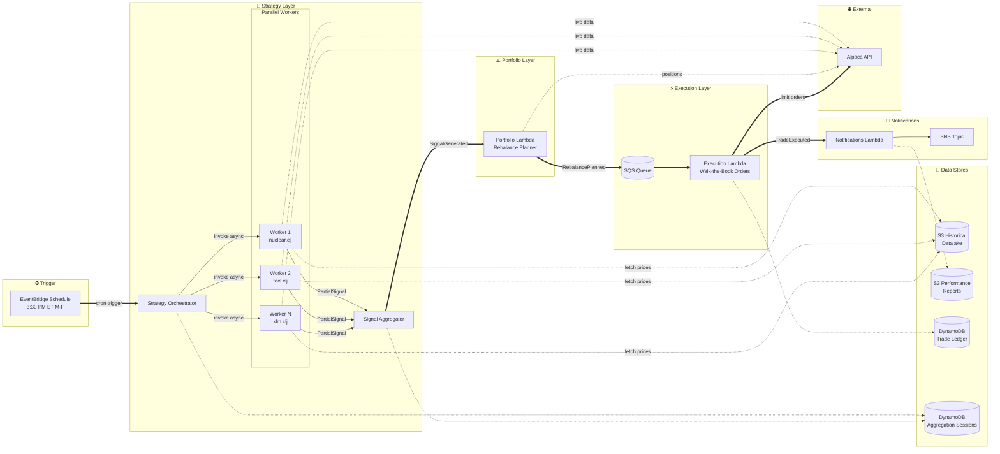
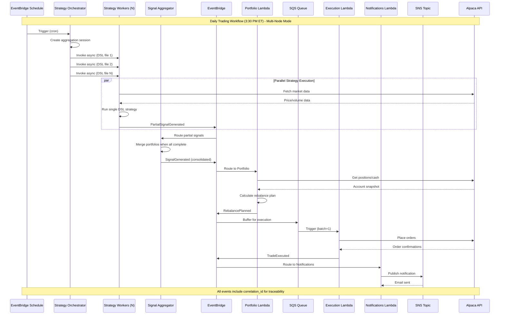

<p align="center">
  
</p>

# The Alchemiser

A multi-strategy quantitative trading system built on event-driven microservices architecture. Combines multiple quantitative strategies into a resilient execution engine with strict module boundaries, end-to-end traceability, and AWS-native event routing.

> 🎯 **New to the platform?** Read the [**Trading Platform Architecture Guide**](docs/TRADING_PLATFORM_GUIDE_REVISED.md) for a comprehensive walkthrough written for traders. It explains how strategies are evaluated, executed in parallel, merged with weighted voting, and deployed to the market—with real code examples and focused Mermaid diagrams.

## System Architecture

The Alchemiser is deployed as **AWS Lambda microservices** communicating via EventBridge, SQS, and SNS. The Strategy layer supports **multi-node horizontal scaling** for parallel strategy execution:



### Workflow Summary

| Step | Component | Action |
|------|-----------|--------|
| 1 | **Strategy Orchestrator** | Triggered by schedule, creates aggregation session, invokes workers async |
| 2 | **Strategy Workers** | Execute `.clj` DSL files in parallel, fetch data from S3 datalake + Alpaca |
| 3 | **Signal Aggregator** | Merges partial signals into single consolidated portfolio |
| 4 | **Portfolio Lambda** | Compares target vs current positions, creates rebalance plan |
| 5 | **Execution Lambda** | Places limit orders using walk-the-book strategy via Alpaca |
| 6 | **Notifications Lambda** | Sends trade summaries via SNS email |

### Lambda Microservices

| Lambda | Function Name | Handler | Trigger | Publishes To |
|--------|---------------|---------|---------|---------------|
| **Strategy Orchestrator** | `alchemiser-{stage}-strategy-orchestrator` | `coordinator_v2.lambda_handler` | EventBridge Schedule (3:30 PM ET M-F) | Invokes Strategy Workers |
| **Strategy Worker** | `alchemiser-{stage}-strategy-worker` | `strategy_v2.lambda_handler` | Orchestrator (async) or Schedule (legacy) | EventBridge: `PartialSignalGenerated` or `SignalGenerated` |
| **Signal Aggregator** | `alchemiser-{stage}-signal-aggregator` | `aggregator_v2.lambda_handler` | EventBridge: `PartialSignalGenerated` | EventBridge: `SignalGenerated` |
| **Portfolio** | `alchemiser-{stage}-portfolio` | `portfolio_v2.lambda_handler` | EventBridge: `SignalGenerated` | EventBridge: `RebalancePlanned` |
| **Execution** | `alchemiser-{stage}-execution` | `execution_v2.lambda_handler` | SQS Queue (from EventBridge) | EventBridge: `TradeExecuted`, `WorkflowCompleted/Failed` |
| **Notifications** | `alchemiser-{stage}-notifications` | `notifications_v2.lambda_handler` | EventBridge: `TradeExecuted`, `WorkflowFailed` | SNS → Email |

Note: Each Lambda now ships its own source under `functions/<name>/` (set as the SAM `CodeUri`). Shared runtime code is provided by the `layers/shared/` layer (referenced in the template as `SharedCodeLayer`). Handlers in the functions use `lambda_handler.lambda_handler` at deploy-time when functions are flattened into `functions/<name>/` directories.

### Module Structure

```
the_alchemiser/
├── coordinator_v2/   # Lambda: Strategy Orchestrator (fans out to workers)
├── strategy_v2/      # Lambda: Strategy Worker (executes single DSL file)
├── aggregator_v2/    # Lambda: Signal Aggregator (merges partial signals)
├── portfolio_v2/     # Lambda: Converts signals to rebalance plans
├── execution_v2/     # Lambda: Executes trades via Alpaca (SQS-triggered)
├── notifications_v2/ # Lambda: Sends email notifications via SNS
└── shared/           # Common DTOs, events, adapters, utilities
```

**Critical Constraint**: Business modules only import from `shared/`. No cross-module dependencies allowed.

## Event-Driven Workflow

The system operates through AWS EventBridge for event routing with SQS buffering for reliable execution:



## AWS Resources (template.yaml)

| Resource | Type | Purpose |
|----------|------|---------|
| `StrategyOrchestratorFunction` | Lambda | Entry point, dispatches parallel strategy execution |
| `StrategyFunction` | Lambda | Worker, executes single DSL strategy file |
| `StrategyAggregatorFunction` | Lambda | Merges partial signals into consolidated portfolio |
| `PortfolioFunction` | Lambda | Converts signals to trade plans |
| `ExecutionFunction` | Lambda | Executes trades via Alpaca |
| `NotificationsFunction` | Lambda | Sends email notifications |
| `AlchemiserEventBus` | EventBridge | Routes events between Lambdas |
| `AggregationSessionsTable` | DynamoDB | Tracks multi-node aggregation sessions |
| `ExecutionQueue` | SQS | Buffers execution requests (reliability) |
| `ExecutionDLQ` | SQS | Dead letter queue (3 retries) |
| `TradingNotificationsTopic` | SNS | Email notification delivery |
| `DLQAlertTopic` | SNS | Alerts when messages hit DLQ |
| `TradeLedgerTable` | DynamoDB | Trade history persistence |
| `PerformanceReportsBucket` | S3 | CSV strategy reports |

## Event Types and Schemas

All events extend `BaseEvent` with correlation tracking and metadata:

### Core Workflow Events

| Event | Publisher | Consumer | Key Fields |
|-------|-----------|----------|------------|
| `PartialSignalGenerated` | Strategy Worker | Signal Aggregator | `session_id`, `dsl_file`, `strategy_number`, `total_strategies`, `signals_data` |
| `SignalGenerated` | Signal Aggregator | Portfolio Lambda | `signals_data`, `consolidated_portfolio`, `signal_count` |
| `RebalancePlanned` | Portfolio Lambda | Execution Lambda (via SQS) | `rebalance_plan`, `allocation_comparison`, `trades_required` |
| `TradeExecuted` | Execution Lambda | Notifications Lambda | `execution_data`, `orders_placed`, `orders_succeeded` |
| `WorkflowCompleted` | Execution Lambda | Notifications Lambda | `workflow_type`, `success`, `summary` |
| `WorkflowFailed` | Any Lambda | Notifications Lambda | `failure_reason`, `failure_step`, `error_details` |

All events include:
- `correlation_id`: End-to-end workflow tracking
- `causation_id`: Parent event reference
- `event_id`: Unique event identifier
- `timestamp`: Event creation time
- `source_module`/`source_component`: Event origin

## Business Module Details

### Strategy Layer (Multi-Node Scaling)

The strategy layer supports **horizontal scaling** via a fan-out/fan-in pattern:

#### Strategy Orchestrator (`coordinator_v2/`)

**Purpose**: Entry point that dispatches parallel strategy execution.

**Trigger**: EventBridge Schedule (3:30 PM ET, M-F)
**Outputs**: Invokes Strategy Workers asynchronously

**Key Components**:
- `lambda_handler.py`: Lambda entry point
- `session_service.py`: Creates aggregation sessions in DynamoDB
- `strategy_invoker.py`: Invokes Strategy Workers via Lambda API

#### Strategy Worker (`strategy_v2/`)

**Purpose**: Execute a single DSL strategy file and generate partial signals.

**Trigger**: Orchestrator (async invoke)
**Outputs**: `PartialSignalGenerated` events

**Key Components**:
- `lambda_handler.py`: Lambda entry point (single-file mode)
- `engines/`: Strategy implementations (Nuclear, TECL, KLM)
- `dsl/`: Clojure-inspired DSL for strategy definitions
- `handlers/`: Event handlers for signal generation
- `adapters/`: Market data access layer

#### Signal Aggregator (`aggregator_v2/`)

**Purpose**: Collect partial signals from all workers and merge into consolidated portfolio.

**Trigger**: EventBridge (`PartialSignalGenerated` events)
**Outputs**: `SignalGenerated` events with merged portfolio

**Key Components**:
- `lambda_handler.py`: Lambda entry point
- `portfolio_merger.py`: Merges partial allocations with validation
- `settings.py`: Aggregator configuration

### Portfolio v2 (`portfolio_v2/`)

**Purpose**: Convert strategy signals into executable rebalance plans.

**Trigger**: EventBridge (`SignalGenerated` events)
**Outputs**: `RebalancePlanned` events with trade specifications

**Key Components**:
- `lambda_handler.py`: Lambda entry point
- `core/planner.py`: Rebalance plan calculator
- `core/state_reader.py`: Portfolio snapshot builder
- `adapters/`: Account data access
- `handlers/`: Event handlers for portfolio analysis

### Execution v2 (`execution_v2/`)

**Purpose**: Execute trades through broker API with proper safeguards.

**Trigger**: SQS Queue (buffered `RebalancePlanned` events)
**Outputs**: `TradeExecuted` + `WorkflowCompleted`/`WorkflowFailed` events

**Key Components**:
- `lambda_handler.py`: Lambda entry point with SQS batch handling
- `core/execution_manager.py`: Order placement coordination
- `handlers/`: Event handlers for trade execution
- `models/`: Execution result DTOs

### Notifications v2 (`notifications_v2/`)

**Purpose**: Send email notifications for trade results and failures.

**Trigger**: EventBridge (`TradeExecuted`, `WorkflowFailed` events)
**Outputs**: SNS messages → Email subscriptions

**Key Components**:
- `lambda_handler.py`: Lambda entry point
- `service.py`: Notification service
- `strategy_report_service.py`: CSV report generation

### Shared (`shared/`)

**Purpose**: Common services, DTOs, and protocols used across all Lambdas.

**Key Components**:
- `events/`: Event schemas, EventBridge publisher
- `notifications/`: SNS publisher for email notifications
- `schemas/`: DTOs for data exchange
- `adapters/`: External service integrations (Alpaca)
- `config/`: Dependency injection container
- `logging/`: Structured logging utilities

## Developer Workflow

### Setup

```bash
# Install with Poetry (recommended)
poetry install --with dev

# Or with pip
pip install -e .
```

### Development Commands

```bash
# Run trading locally (paper mode)
poetry run python -m the_alchemiser

# Format and lint
make format
make lint
make type-check

# Check module boundaries
make import-check

# Run tests
pytest tests/
```

### Testing

```bash
# Run full test suite
pytest

# Test specific modules
pytest tests/strategy_v2/
pytest tests/portfolio_v2/
pytest tests/execution_v2/
pytest tests/notifications_v2/
```

## Configuration

### Environment Variables

```bash
# Required for live trading
ALPACA_API_KEY=your_api_key
ALPACA_SECRET_KEY=your_secret_key
ALPACA_BASE_URL=https://api.alpaca.markets  # or https://paper-api.alpaca.markets

# AWS Resources (set automatically in Lambda)
EVENT_BUS_NAME=alchemiser-dev-events
SNS_NOTIFICATION_TOPIC_ARN=arn:aws:sns:...
TRADE_LEDGER__TABLE_NAME=alchemiser-dev-trade-ledger
PERFORMANCE_REPORTS_BUCKET=alchemiser-dev-reports

# Optional
LOG_LEVEL=INFO
PAPER_TRADING=true  # Default for local runs
```

### AWS Deployment

#### Production & Dev Deployments

```bash
# Deploy to dev (creates beta tag)
make deploy-dev

# Deploy to production (creates release tag)
make deploy-prod
```

#### Ephemeral Deployments (Feature Branch Testing)

Deploy any feature branch as an isolated, temporary stack:

```bash
# Deploy ephemeral stack with 24-hour TTL
make deploy-ephemeral TTL_HOURS=24

# List active ephemeral stacks
make list-ephemeral

# Destroy when done testing
make destroy-ephemeral STACK=alchemiser-ephem-feature-my-feature-a1b2c3d
```

📖 **[Full Ephemeral Deployments Documentation](docs/EPHEMERAL_DEPLOYMENTS.md)**

## Observability

### Structured Logging

All events and operations include structured metadata:

```json
{
  "timestamp": "2024-01-15T10:30:00Z",
  "level": "INFO",
  "correlation_id": "wf-123e4567-e89b-12d3",
  "module": "strategy_v2",
  "component": "SignalGenerationHandler",
  "message": "Generated signals for 5 strategies"
}
```

### Monitoring

- **CloudWatch Logs**: Each Lambda has its own log group
- **DLQ Alerts**: SNS alerts when messages hit the execution DLQ
- **Trade Ledger**: All trades persisted in DynamoDB for analysis

## Error Handling

### Idempotency

All event handlers are idempotent and safe under:
- Message replay
- Network retries
- System restarts

Each event includes deterministic hashes for deduplication.

### Failure Recovery

- `WorkflowFailed` events trigger notification to operators
- SQS DLQ captures failed executions after 3 retries
- Correlation IDs enable precise error tracking across all Lambdas

## Strategies Implemented

### Nuclear Strategy
High-conviction momentum strategy targeting leveraged ETFs with strict risk controls.

### TECL Strategy
Technology sector momentum with dynamic position sizing based on volatility.

### KLM Ensemble
Multi-timeframe ensemble combining trend following with mean reversion signals.

## Architecture Principles

1. **Microservices**: Each Lambda is independently deployable and scalable
2. **Event-Driven Communication**: All inter-Lambda communication via EventBridge
3. **Reliable Execution**: SQS buffering with DLQ for trade execution
4. **Strict Boundaries**: No cross-module imports outside `shared/`
5. **DTO-First**: Type-safe data contracts with Pydantic validation
6. **Idempotent Operations**: Safe under retries and message reordering
7. **Correlation Tracking**: End-to-end traceability via correlation IDs
8. **SNS Notifications**: Email delivery without SMTP credentials

---

**Version**: 2.0.0
**License**: MIT
**Author**: Josh Moreton
**Repository**: [Josh-moreton/alchemiser-quant](https://github.com/Josh-moreton/alchemiser-quant)
