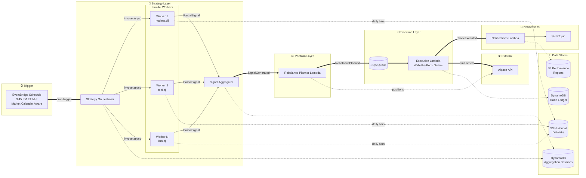
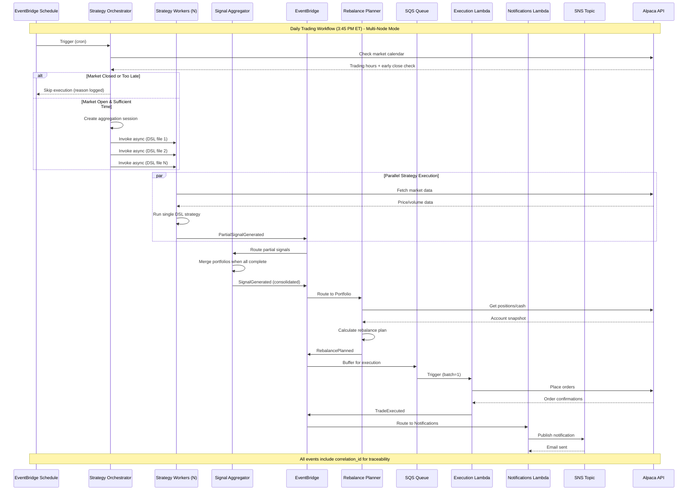

<p align="center">
  
</p>

# The Alchemiser

A multi-strategy quantitative trading system built on event-driven microservices architecture. Combines multiple quantitative strategies into a resilient execution engine with strict module boundaries, end-to-end traceability, and AWS-native event routing.

**Key Features**:
- **Multi-strategy portfolio**: Runs 20+ strategies in parallel, weighted and merged into a single consolidated portfolio
- **DSL-based strategies**: Clojure-inspired domain-specific language for declarative strategy definitions
- **Completed daily bars only**: Uses end-of-day data exclusively for consistent, reproducible signals
- **Event-driven microservices**: AWS Lambda functions communicating via EventBridge, SQS, and SNS
- **Signal validation**: Built-in comparison with external signal sources (Composer.trade)

> **New to the platform?** Read the [**Trading Platform Architecture Guide**](docs/TRADING_PLATFORM_GUIDE_REVISED.md) for a comprehensive walkthrough written for traders.

## Quick Start

```bash
# 1. Clone and install
git clone https://github.com/Josh-moreton/alchemiser-quant.git
cd alchemiser-quant
poetry install --with dev

# 2. Configure environment
cp .env.example .env
# Edit .env with your Alpaca API keys and AWS credentials

# 3. Debug a strategy locally
make debug-strategy s=nuclear

# 4. Deploy to AWS (dev)
make deploy-dev
```

## System Architecture

The Alchemiser is deployed as **AWS Lambda microservices** communicating via EventBridge, SQS, and SNS. The Strategy layer supports **multi-node horizontal scaling** for parallel strategy execution:



### Workflow Summary

| Step | Component | Action |
|------|-----------|--------|
| 0 | **Market Calendar Check** | Orchestrator checks if market is open and has sufficient time before close |
| 1 | **Strategy Orchestrator** | Triggered by schedule, creates aggregation session, invokes workers async |
| 2 | **Strategy Workers** | Execute `.clj` DSL files in parallel, fetch completed daily bars from S3 |
| 3 | **Signal Aggregator** | Merges partial signals into single consolidated portfolio |
| 4 | **Rebalance Planner Lambda** | Compares target vs current positions, creates rebalance plan |
| 5 | **Execution Lambda** | Places limit orders using walk-the-book strategy via Alpaca |
| 6 | **Notifications Lambda** | Sends trade summaries via SNS email |

### Lambda Microservices

| Lambda | Function Name | Handler | Trigger | Publishes To |
|--------|---------------|---------|---------|---------------|
| **Strategy Orchestrator** | `alchemiser-{stage}-strategy_orchestrator` | `coordinator_v2.lambda_handler` | EventBridge Schedule (3:30 PM ET M-F) | Invokes Strategy Workers |
| **Strategy Worker** | `alchemiser-{stage}-strategy_worker` | `strategy_v2.lambda_handler` | Orchestrator (async) or Schedule (legacy) | EventBridge: `PartialSignalGenerated` or `SignalGenerated` |
| **Signal Aggregator** | `alchemiser-{stage}-signal-aggregator` | `aggregator_v2.lambda_handler` | EventBridge: `PartialSignalGenerated` | EventBridge: `SignalGenerated` |
| **Portfolio** | `alchemiser-{stage}-portfolio` | `portfolio_v2.lambda_handler` | EventBridge: `SignalGenerated` | EventBridge: `RebalancePlanned` |
| **Execution** | `alchemiser-{stage}-execution` | `execution_v2.lambda_handler` | SQS Queue (from EventBridge) | EventBridge: `TradeExecuted`, `WorkflowCompleted/Failed` |
| **Notifications** | `alchemiser-{stage}-notifications` | `notifications_v2.lambda_handler` | EventBridge: `TradeExecuted`, `WorkflowFailed` | SNS → Email |

Note: Each Lambda now ships its own source under `functions/<name>/` (set as the SAM `CodeUri`). Shared runtime code is provided by the `shared_layer/` layer (referenced in the template as `SharedCodeLayer`). Handlers in the functions use `lambda_handler.lambda_handler` at deploy-time when functions are flattened into `functions/<name>/` directories.

### Module Structure

```
the_alchemiser/
├── coordinator_v2/   # Lambda: Strategy Orchestrator (fans out to workers)
├── strategy_v2/      # Lambda: Strategy Worker (executes single DSL file)
├── aggregator_v2/    # Lambda: Signal Aggregator (merges partial signals)
├── portfolio_v2/     # Lambda: Converts signals to rebalance plans
├── execution_v2/     # Lambda: Executes trades via Alpaca (SQS-triggered)
├── notifications_v2/ # Lambda: Sends email notifications via SNS
└── shared/           # Common DTOs, events, adapters, utilities
```

**Critical Constraint**: Business modules only import from `shared/`. No cross-module dependencies allowed.

## Market Data Architecture

The system uses **completed daily bars only** - no intraday or partial bar data. This ensures consistent, reproducible signals across backtests and live trading.

### Data Flow

```
                    DATA REFRESH (two schedules)
                    ============================

     ┌─────────────────┐         ┌─────────────────┐
     │  Overnight       │         │  Post-Close      │
     │  (4 AM UTC)      │         │  (4:05 PM ET)    │
     │  Full backfill   │         │  Today's bar     │
     └────────┬─────────┘         └────────┬─────────┘
              │                            │
              └──────────┬─────────────────┘
                         │
                         ▼
              ┌──────────────────────┐
              │  Alpaca Markets API   │
              └──────────┬───────────┘
                         │
                         ▼
              ┌──────────────────────┐
              │   S3 Parquet Cache    │
              │   (complete daily    │
              │    bars only)        │
              └──────────┬───────────┘
                         │
                         ▼
              ┌──────────────────────┐
              │  CachedMarketData    │
              │  Adapter (read)      │
              └──────────┬───────────┘
                         │
                         ▼
              ┌──────────────────────┐
              │   IndicatorService   │
              │  (SMA, RSI, etc.)    │
              └──────────────────────┘
```

### Schedule Overview

| Component | Time | Purpose |
|-----------|------|---------|
| **Overnight Data Refresh** | 4:00 AM UTC | Full historical backfill to S3 (all symbols, ~2 years) |
| **Post-Close Data Refresh** | 4:05 PM ET | Add today's completed daily bar to S3 |
| **Strategy Orchestrator** | ~3:45 PM ET | Run strategies (Schedule Manager, 15 min before close) |
| **Local Signal Generation** | 4:30 PM ET | Generate signals locally for validation (macOS launchd) |

### Why Completed Daily Bars Only?

1. **Reproducibility**: Same signals whether running live or backtesting
2. **Simplicity**: No complex intraday timing or partial-bar handling
3. **Consistency**: All indicators compute on homogeneous data
4. **Validation**: Easy to compare against external signal sources

### Data Lambda Functions

| Lambda | Schedule | Purpose |
|--------|----------|---------|
| `DataRefreshFunction` | 4:00 AM UTC | Fetch 2 years of daily bars for all symbols |
| `PostCloseDataRefreshFunction` | 4:05 PM ET | Fetch today's completed bar (market just closed) |

## Event-Driven Workflow

The system operates through AWS EventBridge for event routing with SQS buffering for reliable execution:



## AWS Resources (template.yaml)

| Resource | Type | Purpose |
|----------|------|---------|
| `StrategyOrchestratorFunction` | Lambda | Entry point, dispatches parallel strategy execution |
| `StrategyFunction` | Lambda | Worker, executes single DSL strategy file |
| `StrategyAggregatorFunction` | Lambda | Merges partial signals into consolidated portfolio |
| `RebalancePlannerFunction` | Lambda | Converts signals to trade plans |
| `ExecutionFunction` | Lambda | Executes trades via Alpaca |
| `NotificationsFunction` | Lambda | Sends email notifications |
| `AlchemiserEventBus` | EventBridge | Routes events between Lambdas |
| `AggregationSessionsTable` | DynamoDB | Tracks multi-node aggregation sessions |
| `ExecutionQueue` | SQS | Buffers execution requests (reliability) |
| `ExecutionDLQ` | SQS | Dead letter queue (3 retries) |
| `TradingNotificationsTopic` | SNS | Email notification delivery |
| `DLQAlertTopic` | SNS | Alerts when messages hit DLQ |
| `TradeLedgerTable` | DynamoDB | Trade history persistence |
| `PerformanceReportsBucket` | S3 | CSV strategy reports |

## Event Types and Schemas

All events extend `BaseEvent` with correlation tracking and metadata:

### Core Workflow Events

| Event | Publisher | Consumer | Key Fields |
|-------|-----------|----------|------------|
| `PartialSignalGenerated` | Strategy Worker | Signal Aggregator | `session_id`, `dsl_file`, `strategy_number`, `total_strategies`, `signals_data` |
| `SignalGenerated` | Signal Aggregator | Rebalance Planner | `signals_data`, `consolidated_portfolio`, `signal_count` |
| `RebalancePlanned` | Rebalance Planner | Execution Lambda (via SQS) | `rebalance_plan`, `allocation_comparison`, `trades_required` |
| `TradeExecuted` | Execution Lambda | Notifications Lambda | `execution_data`, `orders_placed`, `orders_succeeded` |
| `WorkflowCompleted` | Execution Lambda | Notifications Lambda | `workflow_type`, `success`, `summary` |
| `WorkflowFailed` | Any Lambda | Notifications Lambda | `failure_reason`, `failure_step`, `error_details` |

All events include:
- `correlation_id`: End-to-end workflow tracking
- `causation_id`: Parent event reference
- `event_id`: Unique event identifier
- `timestamp`: Event creation time
- `source_module`/`source_component`: Event origin

## Business Module Details

### Strategy Layer (Multi-Node Scaling)

The strategy layer supports **horizontal scaling** via a fan-out/fan-in pattern:

#### Strategy Orchestrator (`coordinator_v2/`)

**Purpose**: Entry point that dispatches parallel strategy execution.

**Trigger**: EventBridge Schedule (3:30 PM ET, M-F)
**Outputs**: Invokes Strategy Workers asynchronously

**Key Components**:
- `lambda_handler.py`: Lambda entry point
- `session_service.py`: Creates aggregation sessions in DynamoDB
- `strategy_invoker.py`: Invokes Strategy Workers via Lambda API

#### Strategy Worker (`strategy_v2/`)

**Purpose**: Execute a single DSL strategy file and generate partial signals.

**Trigger**: Orchestrator (async invoke)
**Outputs**: `PartialSignalGenerated` events

**Key Components**:
- `lambda_handler.py`: Lambda entry point (single-file mode)
- `engines/`: Strategy implementations (Nuclear, TECL, KLM)
- `dsl/`: Clojure-inspired DSL for strategy definitions
- `handlers/`: Event handlers for signal generation
- `adapters/`: Market data access layer

#### Signal Aggregator (`aggregator_v2/`)

**Purpose**: Collect partial signals from all workers and merge into consolidated portfolio.

**Trigger**: EventBridge (`PartialSignalGenerated` events)
**Outputs**: `SignalGenerated` events with merged portfolio

**Key Components**:
- `lambda_handler.py`: Lambda entry point
- `portfolio_merger.py`: Merges partial allocations with validation
- `settings.py`: Aggregator configuration

### Portfolio v2 (`portfolio_v2/`)

**Purpose**: Convert strategy signals into executable rebalance plans.

**Trigger**: EventBridge (`SignalGenerated` events)
**Outputs**: `RebalancePlanned` events with trade specifications

**Key Components**:
- `lambda_handler.py`: Lambda entry point
- `core/planner.py`: Rebalance plan calculator
- `core/state_reader.py`: Portfolio snapshot builder
- `adapters/`: Account data access
- `handlers/`: Event handlers for portfolio analysis

### Execution v2 (`execution_v2/`)

**Purpose**: Execute trades through broker API with proper safeguards.

**Trigger**: SQS Queue (buffered `RebalancePlanned` events)
**Outputs**: `TradeExecuted` + `WorkflowCompleted`/`WorkflowFailed` events

**Key Components**:
- `lambda_handler.py`: Lambda entry point with SQS batch handling
- `core/execution_manager.py`: Order placement coordination
- `handlers/`: Event handlers for trade execution
- `models/`: Execution result DTOs

### Notifications v2 (`notifications_v2/`)

**Purpose**: Send email notifications for trade results and failures.

**Trigger**: EventBridge (`TradeExecuted`, `WorkflowFailed` events)
**Outputs**: SNS messages → Email subscriptions

**Key Components**:
- `lambda_handler.py`: Lambda entry point
- `service.py`: Notification service
- `strategy_report_service.py`: CSV report generation

### Shared (`shared/`)

**Purpose**: Common services, DTOs, and protocols used across all Lambdas.

**Key Components**:
- `events/`: Event schemas, EventBridge publisher
- `notifications/`: SNS publisher for email notifications
- `schemas/`: DTOs for data exchange
- `adapters/`: External service integrations (Alpaca)
- `config/`: Dependency injection container
- `logging/`: Structured logging utilities

## DSL Strategy Engine

Strategies are defined using a **Clojure-inspired domain-specific language (DSL)** that compiles to Python execution. This provides a declarative, readable syntax for portfolio allocation logic.

### Example Strategy

```clojure
;; momentum_etf.clj - Simple momentum strategy
(defsymphony
  "Momentum ETF"
  {:asset-class "EQUITIES", :rebalance-frequency :daily}
  (if-then-else
    (> (rsi {:window 14} (asset "SPY" nil)) 70)
    (weight-equal [(asset "TLT" nil)])       ; Overbought: bonds
    (weight-equal [(asset "SPY" nil)])))     ; Normal: equities
```

### DSL Operators

| Operator | Description | Example |
|----------|-------------|---------|
| `asset` | Single asset reference | `(asset "SPY" nil)` |
| `weight-equal` | Equal-weight allocation | `(weight-equal [(asset "SPY" nil) (asset "QQQ" nil)])` |
| `weight-specified` | Custom weights | `(weight-specified [(asset "SPY" 0.6) (asset "TLT" 0.4)])` |
| `if-then-else` | Conditional logic | `(if-then-else condition then-branch else-branch)` |
| `filter` | Select assets by metric | `(filter (rsi {:window 14}) (select-top 3) [...])` |
| `group` | Named sub-portfolio | `(group "Tech" [...])` |

### Technical Indicators

| Indicator | DSL Syntax | Description |
|-----------|------------|-------------|
| RSI | `(rsi {:window 14} asset)` | Relative Strength Index |
| SMA | `(moving-average-price {:window 200} asset)` | Simple Moving Average |
| EMA | `(exponential-moving-average-price {:window 50} asset)` | Exponential Moving Average |
| Cumulative Return | `(cumulative-return {:window 60} asset)` | Price change over N days |
| Max Drawdown | `(max-drawdown {:window 90} asset)` | Peak-to-trough decline |
| Stdev Return | `(stdev-return {:window 20} asset)` | Volatility (std of returns) |

### Strategy Configuration

Strategies are configured per environment in `shared_layer/python/the_alchemiser/shared/config/`:

```json
// strategy.dev.json
{
  "files": ["gold.clj", "nuclear.clj", "tecl.clj", ...],
  "allocations": {
    "gold.clj": 0.05,
    "nuclear.clj": 0.10,
    "tecl.clj": 0.08,
    ...
  }
}
```

Each strategy's output is weighted by its allocation, then merged into a consolidated portfolio.

## Filterable Groups Cache

For strategies using `filter` on `group` elements (like `select-top` or `select-bottom`), the system pre-computes daily portfolio returns for accurate historical scoring.

### Problem

When filtering groups by their historical performance:

```clojure
(filter (moving-average-return {:window 10}) (select-bottom 1)
  [(group "Strategy A" [...])
   (group "Strategy B" [...])
   (group "Strategy C" [...])])
```

The filter needs each group's portfolio return for the last 10 days. Computing this on-the-fly is expensive and timing-sensitive.

### Solution: On-Demand Group Cache

When a filter operator encounters a named group, the **strategy worker** automatically handles cache population:

1. Checks DynamoDB (`GroupHistoricalSelectionsTable`) for cached portfolio returns
2. On cache miss, re-evaluates the group's AST body for historical dates
3. Computes weighted daily portfolio returns and writes results to DynamoDB
4. Scores the group using the cached return series

Group IDs are derived deterministically from group names using SHA-256 hashing, so no manual configuration is required when adding new strategies or groups.

## Signal Validation

The system includes built-in tools to validate signals against external sources (Composer.trade) using a **shifted T-1 comparison** methodology.

### Validation Workflow

```
                    SIGNAL VALIDATION FLOW
                    ======================

     ┌─────────────────┐         ┌─────────────────┐
     │  Our Signals     │         │  Composer.trade │
     │  (generated at   │         │  (captured at   │
     │   4:30 PM today) │         │   any time)     │
     └────────┬─────────┘         └────────┬─────────┘
              │                            │
              │  Today's signals           │  Today's live signals
              │                            │
              └──────────┬─────────────────┘
                         │
                         ▼
              ┌──────────────────────┐
              │   Shifted T-1        │
              │   Comparison         │
              │                      │
              │   Our T0 signals     │
              │   vs                 │
              │   Composer T-1       │
              └──────────┬───────────┘
                         │
                         ▼
              ┌──────────────────────┐
              │   Validation Report  │
              │   (match %, diffs)   │
              └──────────────────────┘
```

### Commands

```bash
# Validate against Composer.trade
make validate-signals                    # Uses local signals (dev)
make validate-signals stage=prod         # Prod signals
make validate-signals fresh=1            # Start fresh capture

# Debug a single strategy
make debug-strategy s=simons_kmlm        # Full condition tracing
make debug-strategy list=1               # List all strategies
```

## Developer Workflow

### Setup

```bash
# Install with Poetry (recommended)
poetry install --with dev
```

### Development Commands

```bash
# Format and type-check (required before commits)
make format
make type-check

# Debug a specific strategy
make debug-strategy s=simons_kmlm
make debug-strategy list=1              # List all strategies

# Validate signals against Composer.trade
make validate-signals                    # Uses local signals

# Check module boundaries
make import-check
```

### Version Management

All code changes require a version bump before committing:

```bash
git add <your-changed-files>
make bump-patch   # Bug fixes, docs, refactoring
make bump-minor   # New features, new modules
make bump-major   # Breaking changes
```

## Configuration

### Market Calendar

The system integrates with Alpaca's market calendar API to:
- **Skip non-trading days**: Automatically skips weekends and holidays
- **Handle early closes**: Detects half-day trading sessions (e.g., day before holidays)
- **Prevent late executions**: Ensures at least 15 minutes before market close to complete trades

The Strategy Orchestrator checks the market calendar before dispatching any strategy workers:

```python
# Market calendar check happens in orchestrator before strategy execution
should_trade, reason = calendar_service.should_trade_now(
    correlation_id=correlation_id,
    minutes_before_close=15,  # Require 15 minutes before close
)

if not should_trade:
    logger.info("Skipping strategy execution", reason=reason)
    return {"status": "skipped", "reason": reason}
```

**Calendar data is cached for 1 hour** to minimize API calls while staying current with schedule changes.

### Environment Variables

```bash
# Required for live trading (Lambda)
ALPACA_API_KEY=your_api_key
ALPACA_SECRET_KEY=your_secret_key
ALPACA_BASE_URL=https://api.alpaca.markets  # or https://paper-api.alpaca.markets

# Required for market data (Lambda + local)
MARKET_DATA_BUCKET=alchemiser-dev-market-data  # S3 bucket for Parquet cache
AWS_DEFAULT_REGION=us-east-1

# AWS Resources (set automatically in Lambda)
EVENT_BUS_NAME=alchemiser-dev-events
SNS_NOTIFICATION_TOPIC_ARN=arn:aws:sns:...
TRADE_LEDGER__TABLE_NAME=alchemiser-dev-trade-ledger
PERFORMANCE_REPORTS_BUCKET=alchemiser-dev-reports

# Optional
LOG_LEVEL=INFO
PAPER_TRADING=true  # Default for local runs
```

### AWS Deployment

#### Production & Dev Deployments

```bash
# Deploy to dev (creates beta tag)
make deploy-dev

# Deploy to production (creates release tag)
make deploy-prod
```

#### Ephemeral Deployments (Feature Branch Testing)

Deploy any feature branch as an isolated, temporary stack:

```bash
# Deploy ephemeral stack with 24-hour TTL
make deploy-ephemeral TTL_HOURS=24

# List active ephemeral stacks
make list-ephemeral

# Destroy when done testing
make destroy-ephemeral STACK=alchemiser-ephem-feature-my-feature-a1b2c3d
```

📖 **[Full Ephemeral Deployments Documentation](docs/EPHEMERAL_DEPLOYMENTS.md)**

## Observability

### Structured Logging

All events and operations include structured metadata:

```json
{
  "timestamp": "2024-01-15T10:30:00Z",
  "level": "INFO",
  "correlation_id": "wf-123e4567-e89b-12d3",
  "module": "strategy_v2",
  "component": "SignalGenerationHandler",
  "message": "Generated signals for 5 strategies"
}
```

### Monitoring

- **CloudWatch Logs**: Each Lambda has its own log group
- **DLQ Alerts**: SNS alerts when messages hit the execution DLQ
- **Trade Ledger**: All trades persisted in DynamoDB for analysis

### Dashboard

An enhanced multi-page **Streamlit dashboard** provides real-time visibility into the trading system:

**Run locally**:
```bash
make dashboard
# or
poetry run streamlit run dashboard/app.py
```

**Pages**:
- **Portfolio Overview**: Equity curves, risk metrics (Sharpe, max drawdown, volatility), current positions
- **Forward Projection**: Growth scenario modelling and drawdown analysis
- **Last Run Analysis**: Detailed view of recent workflow executions with strategy signals, rebalance plans, and trades
- **Trade History**: Per-strategy and per-symbol attribution, filters by date/symbol, trade analytics
- **Strategy Performance**: Per-strategy P&L, risk metrics, lot-level drill-down
- **Execution Quality**: Transaction cost analysis (TCA), slippage, fill timing
- **Symbol Analytics**: Deep dive into individual symbol performance with P&L analysis and price history
- **Options Hedging**: Hedge positions, roll schedule, premium spend budget

See [Dashboard README](dashboard/docs/README.md) for detailed documentation and deployment instructions.

## Error Handling

### Idempotency

All event handlers are idempotent and safe under:
- Message replay
- Network retries
- System restarts

Each event includes deterministic hashes for deduplication.

### Failure Recovery

- `WorkflowFailed` events trigger notification to operators
- SQS DLQ captures failed executions after 3 retries
- Correlation IDs enable precise error tracking across all Lambdas

## Strategies Implemented

### Nuclear Strategy
High-conviction momentum strategy targeting leveraged ETFs with strict risk controls.

### TECL Strategy
Technology sector momentum with dynamic position sizing based on volatility.

### KLM Ensemble
Multi-timeframe ensemble combining trend following with mean reversion signals.

## Architecture Principles

1. **Completed Daily Bars Only**: No intraday or partial bar data - ensures reproducible signals
2. **Microservices**: Each Lambda is independently deployable and scalable
3. **Event-Driven Communication**: All inter-Lambda communication via EventBridge
4. **Reliable Execution**: SQS buffering with DLQ for trade execution
5. **Strict Boundaries**: No cross-module imports outside `shared/`
6. **DTO-First**: Type-safe data contracts with Pydantic validation
7. **Idempotent Operations**: Safe under retries and message reordering
8. **Correlation Tracking**: End-to-end traceability via correlation IDs
9. **SNS Notifications**: Email delivery without SMTP credentials

---

**Version**: 10.7.5
**License**: MIT
**Author**: Josh Moreton
**Repository**: [Josh-moreton/alchemiser-quant](https://github.com/Josh-moreton/alchemiser-quant)
