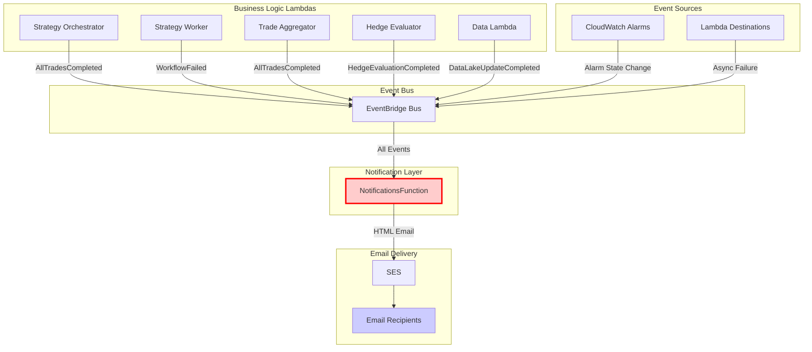
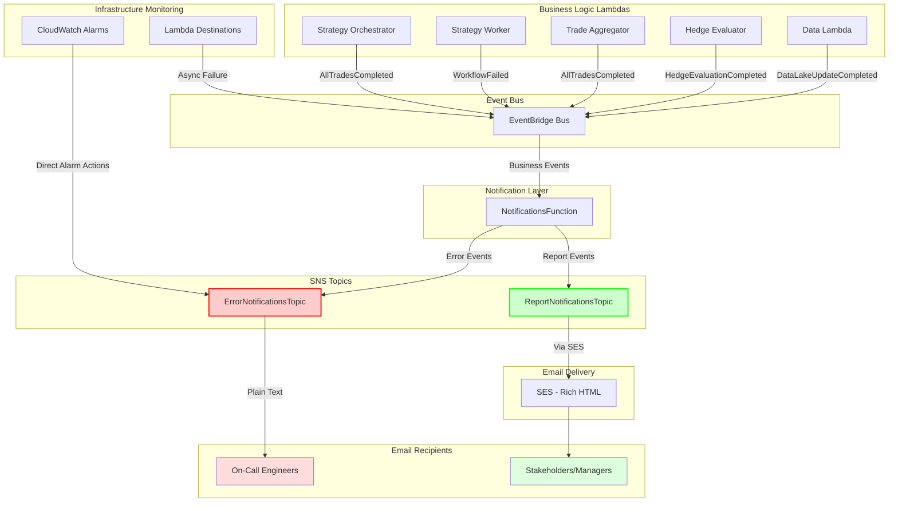
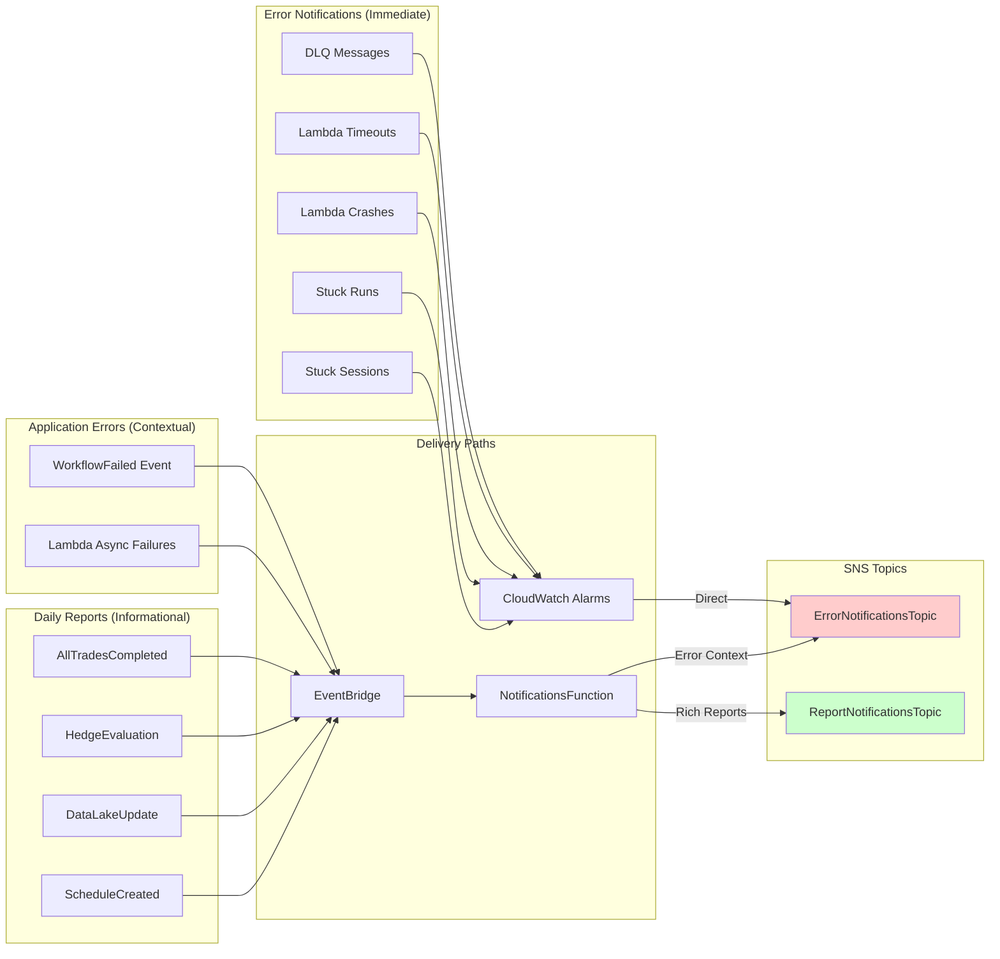
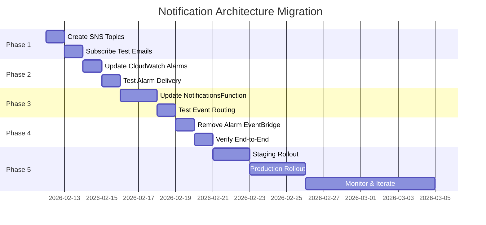
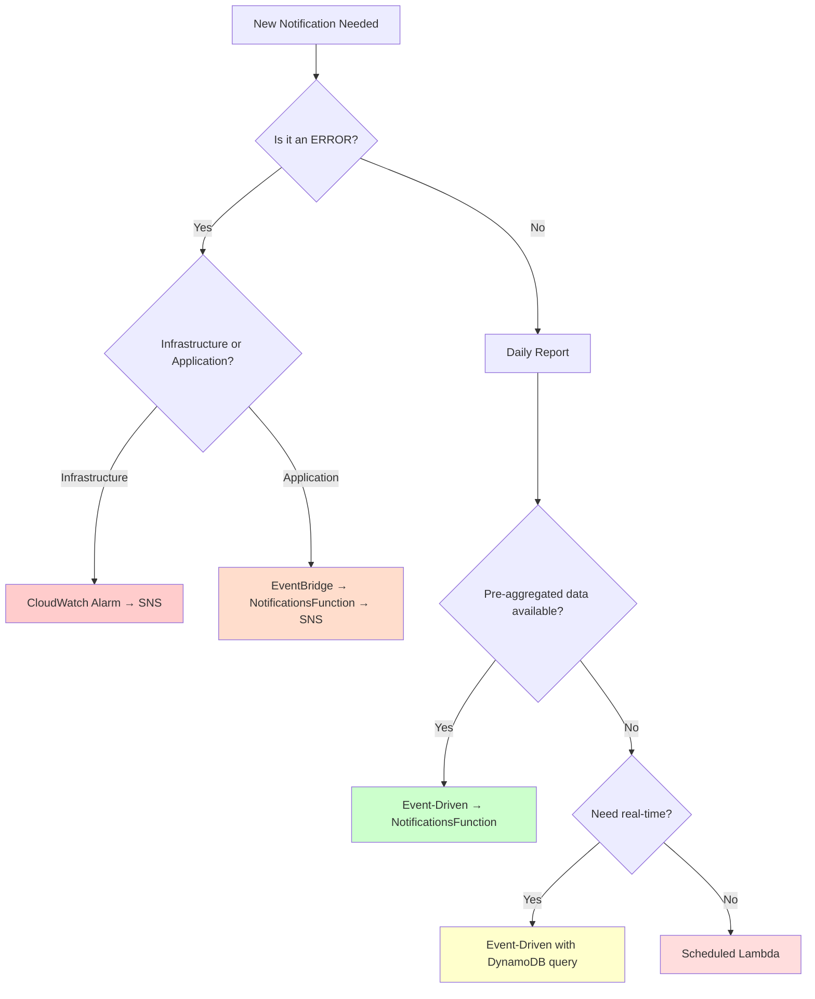

# Notification Architecture Diagrams

## Current Architecture (As-Is)



### Key Issues
- **Single Point of Failure**: NotificationsFunction handles ALL notification types
- **Feedback Loop Risk**: NotificationsErrorsAlarm triggers NotificationsFunction
- **Delayed Error Delivery**: Critical errors wait for Lambda cold start + execution

---

## Recommended Architecture (To-Be)



### Key Improvements
- **Decoupled Error Path**: Infrastructure errors bypass Lambda, go directly to SNS
- **Fast Error Delivery**: CloudWatch → SNS has lower latency than CloudWatch → EventBridge → Lambda → SNS
- **Independent Channels**: Errors and reports have separate SNS topics and subscriber lists
- **Maintained Context**: Application errors still get rich formatting through NotificationsFunction
- **No Feedback Loop**: NotificationsErrorsAlarm doesn't trigger NotificationsFunction

---

## Notification Type Routing



---

## Event Flow Comparison

### Current: All Events → Single Channel

```
Infrastructure Error → CloudWatch Alarm → EventBridge → NotificationsFunction → SES → Email
Application Error   → EventBridge → NotificationsFunction → SES → Email
Daily Report        → EventBridge → NotificationsFunction → SES → Email
```

**Characteristics:**
- Unified (simple)
- Single point of failure
- Slower for critical errors
- Mixed audience (everyone gets everything)

### Recommended: Hybrid Dual-Channel

```
Infrastructure Error → CloudWatch Alarm → SNS (ErrorNotificationsTopic) → Email (On-Call)
Application Error   → EventBridge → NotificationsFunction → SNS (ErrorNotificationsTopic) → Email (On-Call)
Daily Report        → EventBridge → NotificationsFunction → SES/SNS (ReportNotificationsTopic) → Email (Stakeholders)
```

**Characteristics:**
- Separated concerns (errors vs reports)
- Independent reliability
- Faster critical error delivery
- Targeted audience per topic
- Maintained rich context for application events

---

## Implementation Phases



---

## Decision Tree: When to Use Each Pattern



### Pattern Selection Guide

| Notification Type | Pattern | Delivery Path | Latency | Reliability |
|---|---|---|---|---|
| Lambda timeout/crash | CloudWatch Alarm | Alarm → SNS → Email | < 1 min | Very High |
| DLQ messages | CloudWatch Alarm | Alarm → SNS → Email | < 1 min | Very High |
| Stuck execution runs | CloudWatch Alarm | Alarm → SNS → Email | < 5 min | Very High |
| Application errors | Event-Driven | Event → Lambda → SNS → Email | 1-3 min | High |
| Trade summary | Event-Driven | Event → Lambda → SES → Email | 1-3 min | High |
| Daily aggregations | Event-Driven | Event → Lambda → SES → Email | Immediate | High |
| Weekly scheduled reports | Scheduled | Schedule → Lambda → SES → Email | Fixed time | High |

---

## Cost Analysis

### Current Architecture (Monthly)

```
EventBridge: 6 event types × 1 run/day × 30 days = 180 events/month
EventBridge Cost: $0 (first 1M events free)

NotificationsFunction: 6 invocations/day × 30 days = 180 invocations/month
Lambda Cost: $0 (well within free tier)

SES: 6 emails/day × 30 days = 180 emails/month
SES Cost: $0.10/1000 emails = $0.018/month

Total: ~$0.02/month
```

### Recommended Architecture (Monthly)

```
EventBridge: 4 event types × 1 run/day × 30 days = 120 events/month
EventBridge Cost: $0 (first 1M events free)

NotificationsFunction: 4 invocations/day × 30 days = 120 invocations/month
Lambda Cost: $0 (well within free tier)

SNS (Errors): ~5 alarms × 0.5 triggers/month = 2.5 notifications/month
SNS Cost: $0 (first 1000 notifications free)

SNS (Reports): 4 notifications/day × 30 days = 120 notifications/month
SNS Cost: $0 (first 1000 notifications free)

SES: 4 emails/day × 30 days = 120 emails/month
SES Cost: $0.10/1000 emails = $0.012/month

Total: ~$0.01/month
```

**Cost Impact:** Negligible (saves ~$0.01/month)

---

## Monitoring & Observability

### Current Metrics to Monitor

```
CloudWatch Metrics:
- NotificationsFunction Invocations
- NotificationsFunction Errors
- NotificationsFunction Duration
- SES Sent/Delivery/Bounce/Complaint

EventBridge Metrics:
- Failed Invocations
- Throttled Invocations
```

### Additional Metrics After Migration

```
SNS Metrics:
- ErrorNotificationsTopic: NumberOfMessagesPublished
- ErrorNotificationsTopic: NumberOfNotificationsFailed
- ReportNotificationsTopic: NumberOfMessagesPublished
- ReportNotificationsTopic: NumberOfNotificationsFailed

CloudWatch Alarms:
- Alarm state transitions (ALARM → OK)
- Alarm action success/failure
```

### Recommended Dashboards

**Error Notification Dashboard:**
- CloudWatch Alarm state over time
- SNS publish success rate
- Error notification delivery latency
- Failed delivery count

**Report Notification Dashboard:**
- Daily report sent count
- SES delivery success rate
- Email open/bounce rate (if SES tracking enabled)
- NotificationsFunction execution metrics

---

## Testing Checklist

### Phase 1: SNS Topic Creation
- [ ] Topics created in dev environment
- [ ] Test email subscribed to ErrorNotificationsTopic
- [ ] Test email subscribed to ReportNotificationsTopic
- [ ] Subscription confirmations received
- [ ] Manual test message sent to each topic

### Phase 2: CloudWatch Alarm Routing
- [ ] DLQMessageAlarm routes to ErrorNotificationsTopic
- [ ] Manually trigger alarm (put message in DLQ)
- [ ] Verify email delivery via SNS
- [ ] Verify alarm state change logged
- [ ] Repeat for all other alarms

### Phase 3: NotificationsFunction Dual-Routing
- [ ] Environment variables configured
- [ ] IAM policies updated
- [ ] WorkflowFailed event routed to ErrorNotificationsTopic
- [ ] AllTradesCompleted event routed to ReportNotificationsTopic
- [ ] Verify email formatting maintained
- [ ] Test all event types end-to-end

### Phase 4: EventBridge Rule Cleanup
- [ ] CloudWatchAlarmEvent rule removed
- [ ] CloudWatch alarms still deliver via SNS (not EventBridge)
- [ ] NotificationsFunction no longer receives alarm events
- [ ] All other event routing unchanged

### Phase 5: Production Validation
- [ ] All alarm types tested in staging
- [ ] All event types tested in staging
- [ ] Email delivery confirmed for both topics
- [ ] Production subscribers updated
- [ ] Production deployment successful
- [ ] Monitor for 1 week
- [ ] Rollback plan validated

---

## Rollback Plan

If issues arise after migration, rollback is straightforward:

### Immediate Rollback (< 5 minutes)
1. Remove `AlarmActions` from CloudWatch Alarms (revert to EventBridge routing)
2. Redeploy template
3. Verify alarms route to NotificationsFunction via EventBridge

### Full Rollback (< 15 minutes)
1. Revert NotificationsFunction to single-channel SES delivery
2. Remove SNS topic environment variables
3. Remove SNS publish IAM policies
4. Redeploy NotificationsFunction
5. Verify end-to-end email delivery

### No Breaking Changes
- Old event flows continue to work during migration
- SNS topics are additive (can coexist with SES)
- Can test new patterns in parallel with old patterns
- Subscribers can be updated gradually

---

**Document Version:** 1.0  
**Last Updated:** 2026-02-12  
**Author:** GitHub Copilot (Architecture Diagrams)  
**Status:** Draft - Pending Review
