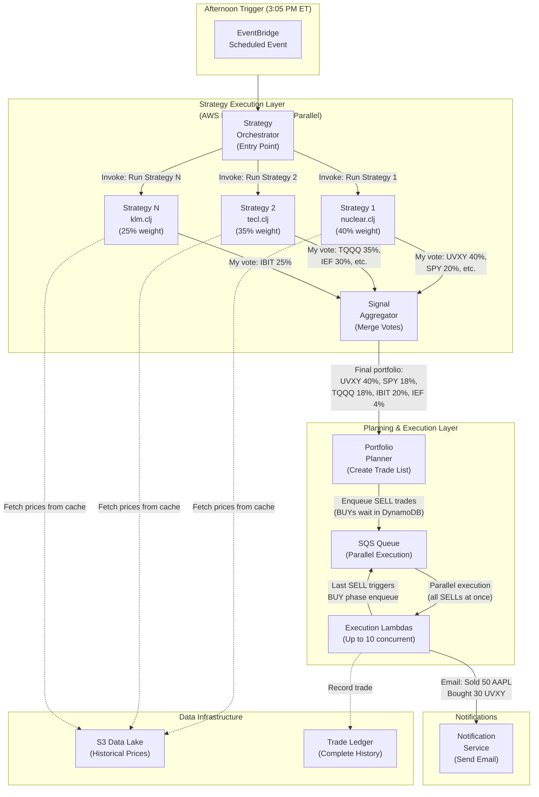
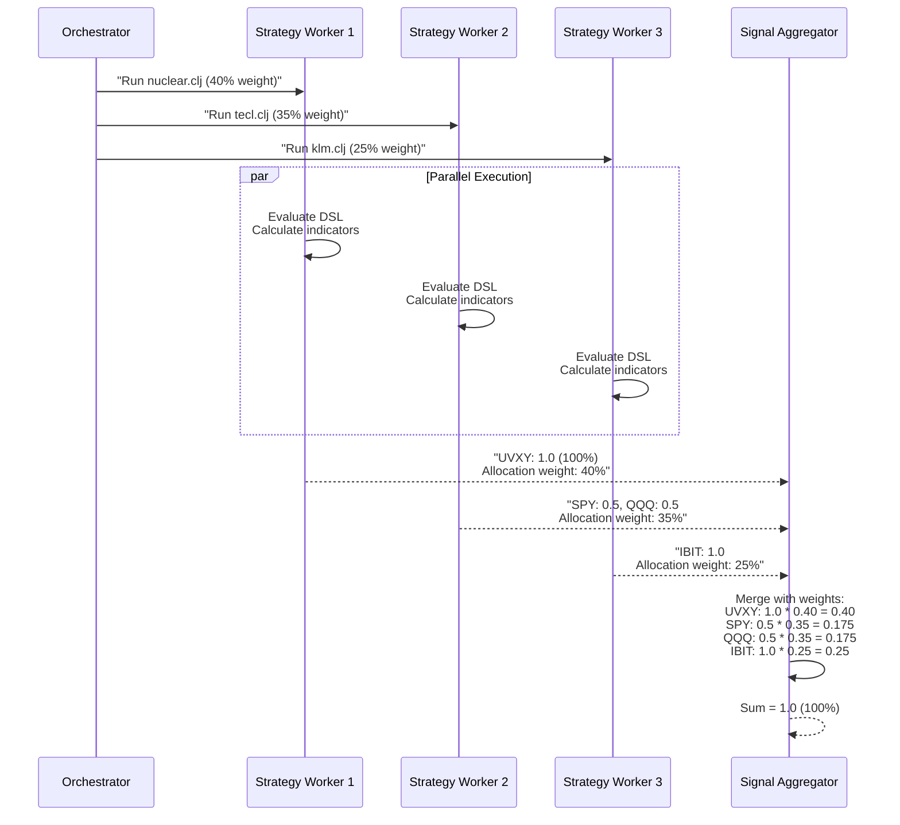
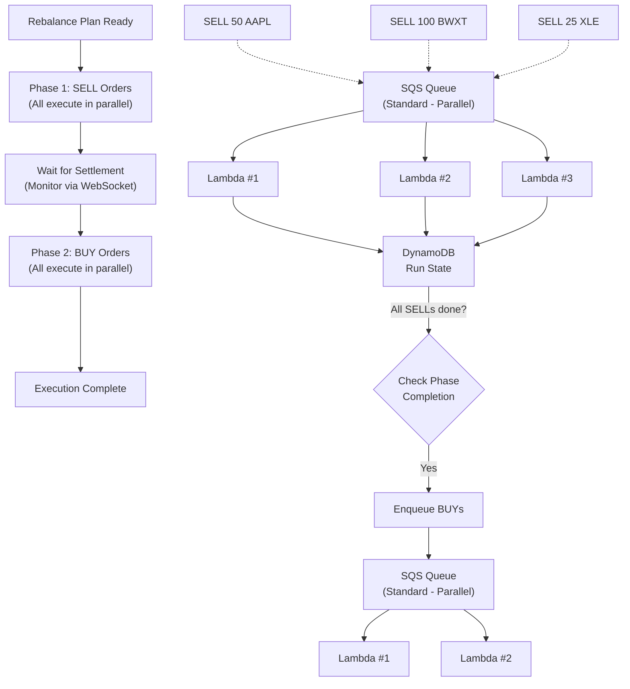
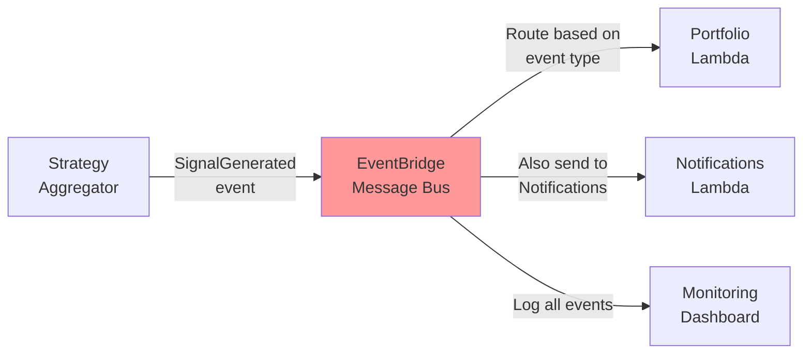

# Composerless Composer

This guide explains how we evaluate Composer-style strategies, convert them into a consolidated portfolio, and execute the resulting trades. It also documents the scheduling, data, execution, and audit trail behind the strategies.

---

## Quick Overview

Every afternoon at 3:05 PM ET the platform runs 16 strategies in parallel (one AWS Lambda per strategy). Each strategy reads cached market data from S3 (refreshed nightly from Alpaca) and outputs target weights. The signal aggregator merges those weights into a single consolidated portfolio, the planner turns the deltas into individual trade messages, and execution runs in two phases: sells first, then buys, with settlement checks between phases. Every fill is written to the trade ledger with the context you need to debug or audit later (decision path, market conditions, and strategy attribution).

Note: The repository is organized so each Lambda ships its own code from `functions/<name>/` (SAM `CodeUri`). Common runtime/business code is provided by `layers/shared/` (deployed as `SharedCodeLayer`) and should not be copied into each function.

---

## The Architecture: Bird's Eye View

Here is the architecture at a glance:


---

## Running Composer Strategies Independently

When you build a strategy in Composer, it outputs a `.clj` file (Clojure S-expressions) representing your decision tree. We export those `.clj` files from Composer and run them independently-bypassing Composer's execution platform entirely.

**Why run independently instead of using Composer's platform?** Composer is US-only, so UK-based traders need to export and execute strategies outside Composer. Running independently also provides:
- **No platform fees** (Composer charges per strategy per month)
- **Better control** over execution logic, retry behavior, and failure handling
- **Better execution** through custom order placement (walk-the-book algorithm vs. Composer's default)
- **Audit trails** integrated with your own infrastructure (DynamoDB, EventBridge)
- **Portfolio consolidation** across multiple strategies with weighted voting

The `.clj` files capture the pure strategy logic (indicators, conditions, allocations) in a way that's stateless and deterministic, so they run the same way every time.

### Example: Nuclear Energy Strategy in .CLJ

Here's a snippet from the Nuclear Energy strategy showing how Composer logic translates:

```clojure
(defsymphony
  "Nuclear Energy with Feaver Frontrunner V5"
  {:asset-class "EQUITIES", :rebalance-frequency :daily}
  
  (weight-equal
    [(group "Bull Scenario"
      [(weight-equal
        [(if (> (rsi "SPY" {:window 10}) 79)
          [(asset "UVXY" "ProShares Ultra VIX Short-Term Futures ETF")]
          [(group "Nuclear Energy Portfolio"
            [(weight-inverse-volatility 90
              [(filter (moving-average-return {:window 90})
                (select-top 3)
                [(asset "SMR" nil)
                 (asset "BWXT" nil)
                 (asset "LEU" nil)])])])])])])])
```

**Translating from Composer logic:**

- **`defsymphony`** = Define a strategy and its properties (rebalance frequency, asset class)
- **`weight-equal`** = Allocate equally across children (like Composer "Equal Weight" rule)
- **`group`** = Logical container for related assets (like a Composer "Portfolio" node)
- **`if (> (rsi "SPY" {:window 10}) 79)`** = Conditional logic (RSI > 79 → then branch)
- **`weight-inverse-volatility`** = Dynamic weighting based on volatility (lower vol = higher allocation)
- **`select-top 3`** = Filtering: keep only top N by metric (e.g., highest 90-day return)
- **`asset "SMR"`** = Allocate to a symbol

If you've built a Composer strategy with "If SPY RSI > 79, then go 100% into VIX ETF, else allocate equally to nuclear stocks by volatility," the `.clj` file above captures exactly that logic.

### Why S-Expressions (Not YAML/JSON)

Composer generates `.clj` files natively; we just execute them. Why did Composer choose S-expressions over YAML or JSON?

- **Nested conditionals work naturally**: `(if condition then else)` mirrors visual if-then branching without template syntax
- **Operators are functions**: `(rsi symbol {:window 10})` can be evaluated and composed at runtime
- **Deterministic evaluation**: Same code → same outputs → reproducible for backtesting and debugging
- **Easy parsing**: S-expressions are simpler to parse and validate than YAML/JSON with custom evaluation engines

---

## How Strategies Get Evaluated: The DSL Engine

When a strategy file is executed, here's what happens:

### Parse the DSL file into a tree

The parser reads `nuclear_feaver.clj` and converts it into a tree structure (called an "Abstract Syntax Tree"):

```python
# Inside strategy_v2/engines/dsl/dsl_evaluator.py

ast = sexpr_parser.parse_file("nuclear_feaver.clj")
# Result: Tree of nested AST nodes
# ASTNode(
#     operator="defsymphony",
#     args=[
#         ASTNode(operator="weight-equal", args=[...]),
#         ASTNode(operator="group", args=[...])
#     ]
# )
```

### Evaluate the tree

The evaluator walks this tree from top to bottom, using a **dispatcher** to route each operator to the right function:

```python
# Inside dsl_evaluator.py - the evaluate() method

def evaluate(self, ast: ASTNode, correlation_id: str) -> StrategyAllocation:
    """Evaluate AST and return portfolio weights."""
    
    # Create evaluation context (current prices, indicators)
    context = DslContext(
        symbols=["UVXY", "SPY", "SMR", "BWXT", "LEU", ...],
        indicator_service=IndicatorService(alpaca_manager),
        current_prices={"UVXY": 23.45, "SPY": 458.32, ...},
        decision_path=[]
    )
    
    # Walk the tree
    result = self._evaluate_node(ast, context)
    
    # Result is: StrategyAllocation with target_weights
    return result
```

### Evaluate node types

Different operators do different things:

```python
# Some core operators:

# Portfolio Assembly
def op_weight_equal(args, context):
    """Split weight equally among all children."""
    child_weights = [evaluate(child, context) for child in args]
    total = sum(child_weights)
    return [w / len(child_weights) for w in child_weights]

# Indicators
def op_rsi(symbol, window, context):
    """Calculate RSI (Relative Strength Index)."""
    prices = context.indicator_service.get_prices(symbol)
    return calculate_rsi(prices, window)

# Conditionals
def op_if(condition, then_branch, else_branch, context):
    """Conditional branching."""
    cond_value = evaluate(condition, context)
    context.decision_path.append({
        "operator": "if",
        "condition_value": cond_value,
        "branch_taken": "then" if cond_value else "else"
    })
    if cond_value:
        return evaluate(then_branch, context)
    else:
        return evaluate(else_branch, context)
```

### Return portfolio weights

After evaluation, you get back:

```python
StrategyAllocation(
    target_weights={
        "UVXY": Decimal("0.40"),     # 40%
        "SPY": Decimal("0.18"),      # 18%
        "TQQQ": Decimal("0.18"),     # 18%
        "IBIT": Decimal("0.20"),     # 20%
        "IEF": Decimal("0.04")       # 4%
    },
    decision_path=[
        {"operator": "if", "condition": "SPY RSI > 79", "branch": "then"},
        {"operator": "weight-inverse-volatility", "applied_to": "nuclear_stocks"},
    ],
    trace_id="sig-123",
    correlation_id="wf-456"
)
```

**That `decision_path`?** That's your audit trail. If a trade goes wrong, you can see exactly what conditions triggered it.

---

## The Multi-Strategy Voting System

Here's where it gets elegant: **all strategies run in parallel**, then **their votes get merged**.



**The algorithm:**

```python
# From aggregator_v2/services/portfolio_merger.py

def merge_partial_signals(partial_allocations):
    """Merge partial signals with allocation weights."""
    
    merged_weights = {}
    
    for allocation in partial_allocations:
        # Get the allocation weight from config
        # (e.g., nuclear.clj gets 40%)
        allocation_weight = get_allocation_weight(allocation.strategy_name)
        
        # For each asset in this strategy's portfolio
        for symbol, weight in allocation.target_weights.items():
            # Contribute: strategy_weight × allocation_weight
            contribution = weight * allocation_weight
            merged_weights[symbol] = merged_weights.get(symbol, 0) + contribution
    
    # Validate: sum should be ≈ 1.0
    total = sum(merged_weights.values())
    assert abs(total - 1.0) < 0.01, f"Weights don't sum to 1.0: {total}"
    
    return merged_weights
```

**Real-world example**:

```
Strategy 1 (Nuclear, 40% weight):   UVXY: 1.0
Strategy 2 (TECL, 35% weight):      SPY: 0.5, QQQ: 0.5
Strategy 3 (Nova, 25% weight):      IBIT: 1.0

Merged:
    UVXY: 1.0 × 0.40 = 0.40 (40%)
    SPY:  0.5 × 0.35 = 0.175 (17.5%)
    QQQ:  0.5 × 0.35 = 0.175 (17.5%)
    IBIT: 1.0 × 0.25 = 0.25 (25%)
    
Total: 0.40 + 0.175 + 0.175 + 0.25 = 1.0 
```

---

## From Weights to Actual Trades: The Rebalance Plan

Now you have target weights. But your current portfolio probably looks different. Here's how the system figures out what to actually buy and sell:

```python
# From portfolio_v2/core/portfolio_service.py (simplified)

def create_rebalance_plan(signal_weights, current_portfolio):
    """
    Convert target weights into actual trade instructions.
    """
    
    # 1. Get current portfolio value
    total_value = sum(pos.market_value for pos in current_portfolio)
    
    # 2. Calculate target dollars per symbol
    target_dollars = {}
    for symbol, target_weight in signal_weights.items():
        target_dollars[symbol] = total_value * target_weight
    
    # 3. Calculate what we need to trade
    trades = []
    for symbol in all_symbols:
        current_value = current_portfolio.get(symbol, 0).market_value
        target_value = target_dollars[symbol]
        difference = target_value - current_value
        
        # Only trade if difference is meaningful (> $100 threshold)
        if difference > 100:
            trades.append(Trade(
                symbol=symbol,
                action="BUY",
                dollars=difference
            ))
        elif difference < -100:
            trades.append(Trade(
                symbol=symbol,
                action="SELL",
                dollars=abs(difference)
            ))
    
    return trades
```

**Example:**

```
Portfolio total value: $1,000,000

Current State:           Target Allocation:
AAPL: $200,000 (20%)    → AAPL: $100,000 (10%)
SPY:  $150,000 (15%)    → SPY:  $300,000 (30%)
UVXY: $0        (0%)    → UVXY: $400,000 (40%)
Cash: $650,000          → Cash: $200,000

Trades Needed:
     SELL $100,000 AAPL (reduce 20% → 10%)
     BUY  $150,000 SPY  (add 15% → 30%)
     BUY  $400,000 UVXY (add 0% → 40%)
(First selling frees up $100k, so net buy is $400k - $100k = $300k)
```

---

## The Execution Engine: Why We Do Sells First, Then Buys

We use **two-phase parallel execution**:



### The Queue System: Parallel Execution with Two-Phase Control

You could execute all trades in a single Lambda-it wouldn't hit the timeout ceiling. But there are better reasons to split execution:

**1. Parallel execution with rate limiting**
- One Lambda executing 10 trades sequentially = 20+ seconds
- 10 Lambdas in parallel = all trades execute simultaneously, fills in ~2 seconds
- `ReservedConcurrentExecutions: 10` respects Alpaca API limits (200 calls/min)

**2. Resilience & retry safety**
- If a single Lambda crashes mid-execution, you lose partial state
- With SQS: failed trades go to DLQ, succeeded trades already persisted, failed trades retry independently
- Each trade is autonomous-idempotent, retryable, isolated

**3. Two-phase ordering via enqueue timing**
- Portfolio Lambda enqueues **only SELL trades** to start
- DynamoDB tracks which SELLs are complete
- When the last SELL completes, the Execution Lambda triggers the BUY phase
- BUY trades are then enqueued and execute in parallel

**4. Visibility & debugging**
- Each trade = one CloudWatch log entry, one DynamoDB record, one event
- Easy to see which trades succeeded, which failed, retry specific ones
- One monolithic execution = mixed concerns in logs

```python
# From portfolio_v2/handlers/portfolio_analysis_handler.py (simplified)

def enqueue_trades(rebalance_plan, run_id):
    """Break rebalance plan into individual trades and queue them."""
    
    sqs_client = boto3.client('sqs')
    
    # Only enqueue SELLs initially (BUYs wait for SELL completion)
    for trade in rebalance_plan.sells:
        message = {
            "run_id": run_id,
            "trade_id": str(uuid.uuid4()),
            "symbol": trade.symbol,
            "action": "SELL",
            "quantity": trade.quantity,
            "phase": "SELL",
        }
        
        # Standard queue (not FIFO) - enables parallel Lambda invocations
        sqs_client.send_message(
            QueueUrl=EXECUTION_QUEUE_URL,
            MessageBody=json.dumps(message),
            MessageAttributes={
                "RunId": {"DataType": "String", "StringValue": run_id},
                "Phase": {"DataType": "String", "StringValue": "SELL"},
            }
        )
    
    # BUYs are stored in DynamoDB, enqueued AFTER all SELLs complete
    # (Triggered by _check_and_trigger_buy_phase in Execution Lambda)
```

---

## The Execution Lambda: Placing Orders with Intelligence

Each trade is processed by a single Lambda invocation. Here's what happens:

```python
# From execution_v2/handlers/single_trade_handler.py (simplified)

def handle_sqs_record(sqs_record):
    """Execute a single trade from the queue."""
    
    trade = parse_trade_message(sqs_record['body'])
    
    # Step 1: Check if already executed (idempotency)
    if already_executed(trade.trade_id):
        logger.info(f"Trade {trade.trade_id} already executed, skipping")
        return {"success": True, "skipped": True}
    
    # Step 2: Place the order
    executor = Executor(alpaca_manager)
    result = executor.execute_order(
        symbol=trade.symbol,
        side=trade.action,        # BUY or SELL
        quantity=trade.quantity
    )
    
    # Step 3: Record the execution
    record_trade(
        trade_id=trade.trade_id,
        symbol=trade.symbol,
        action=trade.action,
        filled_quantity=result.quantity,
        filled_price=result.price,
        timestamp=datetime.now(UTC),
        status="FILLED"
    )
    
    # Step 4: Emit event for notifications
    publish_to_eventbridge(TradeExecuted(
        trade_id=trade.trade_id,
        symbol=trade.symbol,
        quantity=result.quantity,
        price=result.price,
        correlation_id=get_correlation_id()
    ))
    
    # Step 5: Check if this was the last SELL
    # If so, enqueue all BUYs
    if trade.phase == "SELL" and is_last_sell(trade.run_id):
        enqueue_buy_trades(trade.run_id)
    
    return {"success": True, "trade_id": trade.trade_id}
```

### The Walk-the-Book Algorithm: Balancing Speed vs Slippage

When placing an order, you face a tradeoff:
- **Market order** = Fast fill, but might get bad price. This is how Composer does it.
- **Limit order** = Good price, but might not fill.

We use **walk-the-book**:

```
Goal: Buy 100 shares of AAPL

Step 1 (T+0s): Place limit order @ 75% toward ask price
               Current bid: $150, ask: $152
               Place limit @ $150.50
               → Wait 30 seconds
               → If filled:  Done
               → If not filled: Continue...

Step 2 (T+30s): Peg to 85% toward ask
               Place limit @ $151.00
               → Wait 30 seconds
               → If filled:  Done
               → If not filled: Continue...

Step 3 (T+60s): Peg to 95% toward ask
               Place limit @ $151.50
               → Wait 30 seconds
               → If filled:  Done
               → If not filled: Continue...

Step 4 (T+90s): Give up and place market order
               → Fill immediately (might get $151.98, but better than waiting forever)
```

This balances:
-  Getting good fills (limit orders)
-  Ensuring orders actually execute (market order fallback)
-  Not waiting forever (90-second total timeout)

The next logical evolution for this is volume/liquidity aware pricing strategies and longer timeframes to pick up cheap liquidity across the final few hours of the trading day.

---

## The Data Layer: Why You Need a Datalake

Raw API calls are expensive. Every time a strategy evaluates, it needs historical price data:

- 16 strategies
- Each calling Alpaca API for 100+ symbols
- Multiple timeframes (daily, 10-minute bars, etc.)
- = **Thousands of API calls per day**

**Solution: S3 Datalake**

Every night at 4 AM UTC, a Lambda runs:

```python
# Pseudocode: data_v2 Lambda

def fetch_and_cache_market_data():
    """
    Fetch latest market data from Alpaca and cache in S3.
    """
    
    # Read list of symbols from strategy files
    symbols = get_all_strategy_symbols()  # 50+ symbols
    
    # Fetch last 365 days of daily bars for each
    for symbol in symbols:
        bars = alpaca_api.get_bars(
            symbol=symbol,
            timeframe='1Day',
            limit=365
        )
        
        # Convert to Parquet (compressed, efficient columnar format)
        df = pd.DataFrame(bars)
        
        # Save to S3
        s3.put_object(
            Bucket='alchemiser-datalake',
            Key=f'{symbol}/daily/bars.parquet',
            Body=parquet_bytes
        )
```

Then when strategies run:

```python
# Strategy Lambda: Load from cache first

# Option 1: Load historical from cache
bars_df = pd.read_parquet(
    f's3://alchemiser-datalake/{symbol}/daily/bars.parquet'
)

# Option 2: Load live data from Alpaca (for today's bar)
live_bar = alpaca_api.get_latest_bar(symbol)
bars_df = pd.concat([bars_df, live_bar])

# Now evaluate strategy with full history
```

**Cost savings:**
-  1 API call per symbol per night (fixed cost)
-  vs. 1000+ calls per day (variable cost)
-  Faster (S3 = milliseconds vs. API = seconds)

---
 


Here's how an event flows:

```python
# From shared/events/eventbridge_publisher.py

def publish_to_eventbridge(event):
    """Publish domain event to EventBridge."""
    
    client = boto3.client('events')
    
    # Serialize event to JSON
    detail = json.dumps(
        event.model_dump(),
        cls=DecimalEncoder  # Handle Decimal types
    )
    
    # Publish to EventBridge
    response = client.put_events(
        Entries=[
            {
                'Source': f'alchemiser.strategy',  # e.g., alchemiser.portfolio
                'DetailType': 'SignalGenerated',   # e.g., TradeExecuted
                'Detail': detail,
                'EventBusName': 'AlchemiserEventBus'
            }
        ]
    )
    
    logger.info(
        "Event published to EventBridge",
        extra={
            "event_type": type(event).__name__,
            "correlation_id": event.correlation_id,
            "event_id": event.event_id
        }
    )
```

**Why not just call Lambda directly?** EventBridge provides loose coupling (components don't need to know each other's ARNs), scalability (add new consumers without code changes), automatic retry logic, built-in dead letter queues for failed events, and content-based routing by detail-type or source. With direct Lambda calls, you'd need to manage all of that yourself.

---

## Traceability: Following the Thread

Every event has a **correlation ID** that ties everything together:

```python
# Example event flow with correlation ID:

correlation_id = "wf-123e4567-e89b-12d3"

# 1. Orchestrator starts
logger.info("Starting workflow", extra={"correlation_id": correlation_id})

# 2. Invokes workers
worker_event = {
    "correlation_id": correlation_id,
    "causation_id": "orchestrator-start"
}

# 3. Worker emits partial signal
partial_signal = PartialSignalGenerated(
    correlation_id=correlation_id,           # ← Same ID
    causation_id="orchestrator-start",       # ← Trace back to cause
    event_id="sig-456",
    ...
)

# 4. Aggregator receives and publishes merged signal
merged_signal = SignalGenerated(
    correlation_id=correlation_id,           # ← Same ID through system
    causation_id="strategy_worker-1,2,3",    # ← All 3 workers contributed
    ...
)

# 5. Portfolio Lambda receives
rebalance = RebalancePlanned(
    correlation_id=correlation_id,           # ← Still same ID
    causation_id="aggregator-merge",
    ...
)

# 6. Trades execute
trade = TradeExecuted(
    correlation_id=correlation_id,           # ← Same ID
    ...
)

# Query: Find everything related to this workflow
SELECT * FROM trade_ledger 
WHERE correlation_id = 'wf-123e4567-e89b-12d3'
```

This lets you see **exactly what happened** in a workflow, in order, across all components.

---

## Trade Ledger: Your Audit Trail

Every trade is recorded in DynamoDB with complete context:

```json
{
    "trade_id": "trade-789",
    "correlation_id": "wf-123e4567-e89b-12d3",
    "symbol": "AAPL",
    "action": "SELL",
    "quantity": 50,
    "fill_price": "150.25",
    "fill_quantity": 50,
    "timestamp": "2025-01-15T14:30:00Z",
    "strategy_attribution": {
        "strategy_1_nuclear": 0.40,
        "strategy_2_tecl": 0.35,
        "strategy_3_nova": 0.25
    },
    "market_conditions": {
        "bid": "150.20",
        "ask": "150.30",
        "spread": "0.10"
    },
    "decision_path": [
        {
            "operator": "if",
            "condition": "RSI(SPY, 10) > 79",
            "value": true,
            "branch_taken": "then"
        }
    ],
    "status": "FILLED"
}
```

With this data, you can ask questions like:
- Which strategies contributed to this trade?
- What market conditions existed when we traded?
- Did RSI really trigger this, or something else?
- How much did we pay vs. market price?

---

## Putting It All Together: A Complete Workflow

A typical afternoon looks like this:

```
3:05:00 PM ET - EventBridge Schedule fires
        ↓
Orchestrator Lambda starts
    - Generates correlation_id: wf-123e4567-e89b-12d3
    - Creates DynamoDB session (id=wf-123e4567...)
    - Logs: "Starting workflow wf-123e4567..."

3:05:01 PM ET - Orchestrator invokes 3 workers in parallel
    - Worker 1: nuclear.clj (40% weight)
    - Worker 2: tecl.clj (35% weight)
    - Worker 3: klm.clj (25% weight)
    All with: correlation_id=wf-123e4567...

3:05:05 PM ET - Worker 1 starts
    - Fetches 100 symbols from S3 datalake
    - Evaluates DSL (if/then, RSI, moving averages)
    - Returns: UVXY: 1.0 (100%)
    - Publishes PartialSignalGenerated event

3:05:06 PM ET - Worker 2 starts
    - Similar process...
    - Returns: SPY: 0.5, QQQ: 0.5
    - Publishes PartialSignalGenerated event

3:05:07 PM ET - Worker 3 starts
    - Similar process...
    - Returns: IBIT: 1.0
    - Publishes PartialSignalGenerated event

3:05:10 PM ET - Signal Aggregator triggered
    - Receives 3 partial signals
    - Checks: received_count (3) == total_count (3) 
    - Merges: UVXY: 0.40, SPY: 0.175, QQQ: 0.175, IBIT: 0.25
    - Publishes SignalGenerated event

3:05:11 PM ET - Portfolio Lambda triggered
    - Receives merged signal
    - Fetches current portfolio from Alpaca
    - Calculates rebalance plan:
        * SELL 50 AAPL
        * BUY 40 UVXY
        * BUY 30 SPY
    - Enqueues SELL trades to SQS (parallel execution)

3:05:12 PM ET - Execution Lambda (1st invocation)
    - Processes SQS record: SELL 50 AAPL
    - Checks idempotency: not seen before 
    - Places limit order
    - Records trade in ledger
    - Emits TradeExecuted event
    - Checks: is_this_last_sell? Yes! 
    - Enqueues BUY trades to SQS

3:05:13 PM ET - Execution Lambda (2nd invocation)
    - Processes SQS record: BUY 40 UVXY
    - Places order, records trade
    
3:05:14 PM ET - Execution Lambda (3rd invocation)
    - Processes SQS record: BUY 30 SPY
    - Places order, records trade

3:05:15 PM ET - Notifications Lambda triggered
    - Receives all TradeExecuted events
    - Generates report:
        *  Sold 50 AAPL @ $150.25
        *  Bought 40 UVXY @ $23.50
        *  Bought 30 SPY @ $458.32
    - Sends email via SNS

3:05:20 PM ET - Your inbox
     Trading Summary for 2025-01-15
     3 trades executed
     P&L: +$234.56
```

**Throughout this entire flow:**
-  Every step is logged with correlation_id
-  Every trade is recorded in the ledger
-  If anything fails, it's retried automatically
-  You have complete auditability

---

## Why This Architecture Is Better Than Simple Approaches

It is reasonable to ask: *"Why is all this so complicated? Why not just hardcode it simpler?"*

### Problem 1: Single Lambda Timeout (15 minutes)

The simple approach would run everything in one Lambda. But parsing 16 DSL strategies with indicator calculations takes 10+ minutes alone. Then 100 trades at up to 90 seconds each (walk-the-book) could take 2.5+ hours. One timeout means the whole workflow fails and partial state is lost.

We run 16 strategy workers in parallel, completing in seconds instead of minutes. Each trade Lambda processes exactly one trade with a 90-second max. With 10 trade Lambdas running in parallel (the concurrency limit), there's no timeout risk and each component has headroom.

### Problem 2: Order Dependency (Sells before Buys)

The simple approach would execute all trades concurrently. But buys might fill before sells, leaving insufficient buying power, and orders would fill in random order.

We use two-phase parallel execution with settlement monitoring. All sells execute in parallel (up to 10 concurrent Lambdas), and DynamoDB tracks phase state. When all sells complete, buys are enqueued. A settlement monitor watches the WebSocket for cash availability, and then all buys execute in parallel.

### Problem 3: Strategy Extensibility

The simple approach would hardcode each strategy in Python. Adding a new strategy means a code change plus redeploy. Strategy logic gets mixed with infrastructure, and changing a strategy requires restarting the system.

We use DSL plus multi-node orchestration. Adding a strategy means adding a DSL file and a config change. No code deployment is needed, and strategy changes are automatically picked up on the next run.

### Problem 4: Loss of Context (Why Did This Happen?)

The simple approach would log some information. But if something goes wrong, what triggered it? You can't replay the decision, and there's no audit trail.

We record the decision path with correlation IDs. You can see the exact condition that triggered a trade, replay the workflow with the same inputs, and have a complete audit trail for compliance.

### Problem 5: Failure Resilience

The simple approach means if one part fails, everything fails. Orchestrator down means no strategies run. Portfolio Lambda crash means trades don't execute. Manual recovery is required.

We're event-driven with DynamoDB sessions. Component failures don't cascade, retry logic is built in, and idempotent operations make it safe to retry.

---

### Real-World Benefits

**Cost Savings.** The datalake approach means 1 API call per symbol per night (fixed cost) versus 1000+ calls per day (variable cost). S3 reads complete in milliseconds while API calls take seconds per symbol. And Alpaca sometimes returns empty data, so caching provides reliability.

**Speed.** Strategy execution runs 20-30 seconds end-to-end, from orchestrator through workers, aggregator, portfolio, to execution.

**Reliability.** Failed trades retry automatically through the SQS dead-letter queue, which captures repeated failures. Other trades continue even if one fails, and complete trade history in DynamoDB enables investigation.

**Auditability.** The full decision path is recorded, including which RSI values and which conditions triggered each trade. Correlation IDs thread through all events, and strategy attribution shows which strategies contributed to each allocation.

---

## Summary

This platform bridges Composer strategies into a scalable, auditable execution system. Composer logic translates to `.clj` DSL files for deterministic evaluation. Workers run independently and their allocations merge with weights. Two-phase enqueue ensures sells complete before buys, with automatic retries and DLQ for failures. Correlation IDs, decision paths, and the trade ledger create a complete audit trail.

The result is institutional-scale trading infrastructure that maintains the flexibility of Composer strategies.
