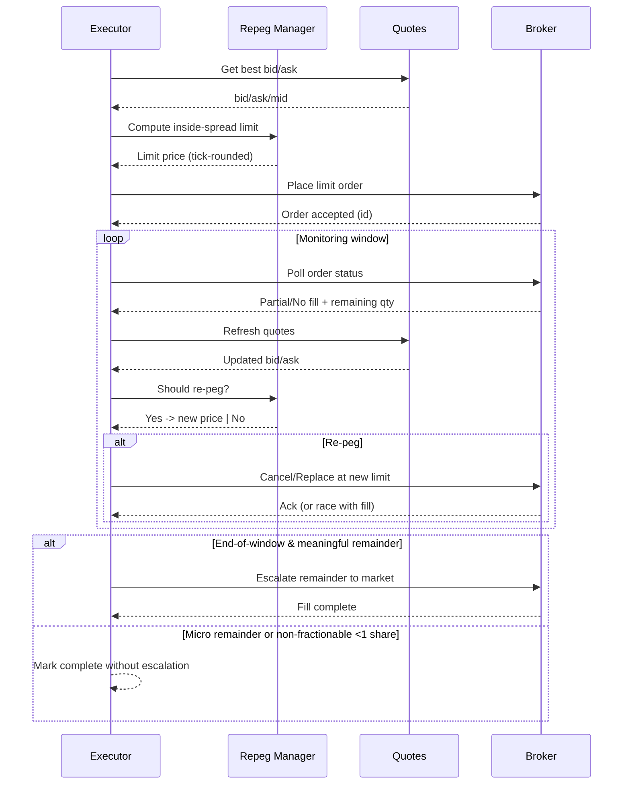

# Limit Order Pricing Strategy

This document explains how our smart execution engine prices limit orders, places them inside the spread, reacts to failures or partial fills, and guarantees a fill within the configured execution window.

The implementation lives primarily in the execution domain:

- Smart pricing and pegging: `the_alchemiser/execution_v2/core/smart_execution_strategy/`
- Orchestrated execution and monitoring: `the_alchemiser/execution_v2/core/executor.py`
- Quote and asset metadata: `the_alchemiser/shared/`

We reference “BUY” below; SELL is symmetric unless stated otherwise.

## Inputs and references

- Live quotes: best bid, best ask, last trade, and derived mid = (bid + ask) / 2.
- Asset metadata: fractionability and exchange-specific rules.
- Execution configuration: parameters controlling spread placement, re-peg cadence, and final escalation. Notably:
  - `min_fractional_notional_usd` — fractional orders below this notional are ignored/skipped (default 1.00 USD) to avoid broker rejections and bad cost-basis noise.
- Timebox: an execution window within which we work the order passively before escalating.

All monetary math uses Decimal; float equality is avoided and monetary comparisons are rounded appropriately.

## Initial price selection (inside the spread)

Goal: seek liquidity without immediately crossing the spread, while protecting price.

- Reference prices:
  - BUY: The “workable” reference is the current best ask and the mid price. We choose an initial limit strictly below the best ask to remain non-marketable.
  - SELL: Mirror logic using best bid; initial limit strictly above the best bid.
- Inside-spread placement policy:
  - Compute the spread = ask − bid. If the spread is tight (one tick), we generally peg to the passive side with a one-tick improvement if supported (e.g., midpoint or sub-penny is not used; we respect tick-size).
  - For typical spreads: place the initial limit at a price inside the spread using an aggression factor (0..1) of the distance from the passive side toward mid. Lower aggression is more passive (closer to bid for BUY), higher is more active (closer to ask for BUY).
  - Prices are rounded to the venue tick (e.g., $0.01) and never exceed the best-ask for BUY (nor go below best-bid for SELL) to avoid becoming marketable unintentionally.

This policy ensures we rest at a competitive price while controlling adverse selection.

## Pegging and re-peg cadence

Quotes move; we keep our resting order in a good place by cancel/replace:

- If the reference quote moves such that our order is no longer at the intended inside-spread location, we re-peg by canceling and submitting a new limit at the recalculated price.
- Re-peg triggers:
  - Quote drift beyond a small tolerance relative to spread.
  - Order remains unfilled for a short interval while better-priced quotes appear.
  - Partial fill stalls near the end of the window.
- Re-peg safety:
  - We respect fractionability and min-notional when sizing any residual child order.
  - For fractional assets: if the remaining notional is below `min_fractional_notional_usd`, we consider the leg complete and do not place “micro” residuals.
  - For non-fractionable assets: if rounding the remaining shares to whole units yields zero, we consider the leg complete.

### Re-peg cycle (sequence)

## Sizing and fractionability rules

- Incoming plan items specify a trade_amount in USD; quantity is estimated using a side-aware reference price:
  - BUY uses an ask-side estimator; SELL uses a bid-side estimator.
- We cap SELL quantities by the available position. We never attempt to sell more than we hold.
- Fractionability enforcement:
  - Non-fractionable assets: round down to whole shares; if result is zero, we skip placing the order.
  - Fractional assets: allow sub-share quantities but enforce the `min_fractional_notional_usd` threshold to avoid broker rejections and cost-basis issues.

## Failure handling and resiliency

We treat the smart execution as a sequence of idempotent child orders managed by an order tracker. Typical outcomes:

- Rejection on place (e.g., price outside venue bands, restriction):
  - We capture the reason, adjust inputs when possible (e.g., move price within permissible bands), and retry within the execution window.
  - Non-recoverable rejections (halts, SSR constraints, or account-level blocks) are surfaced and the leg is marked terminal.
- Cancellation/replace failures:
  - If a cancel fails due to race with a fill, we refresh status and proceed based on the updated remaining quantity.
- Partial fills:
  - Remaining quantity is re-evaluated after every fill update using the fractionability/min-notional rules above to decide whether to continue working or to consider the leg complete.

All handlers are idempotent and carry correlation/causation IDs so that retries and replays do not duplicate effects.

## Ensuring a fill (final escalation)

We always attempt to complete the order within the configured window:

- As the window nears expiry, aggression increases during re-pegs, biasing prices closer to the marketable side.
- At the end of the window, if a non-trivial remainder still exists:
  - For fractional assets: if remaining notional ≥ `min_fractional_notional_usd`, we escalate to a market order for the remaining quantity.
  - For non-fractionable assets: if at least one whole share remains after rounding, we escalate to a market order for that whole-share remainder.
- If no meaningful quantity remains per the rules above, we do not escalate (to avoid noise and rejections) and mark the leg complete.

This guarantees practical completion while respecting venue rules and avoiding micro residuals that cannot be filled reliably.

## Edge cases and safeguards

- Trading halts and SSR: We detect venue restrictions from broker responses; escalation is suppressed and the leg is marked terminal with a structured error.
- Extreme spreads or crossed markets: We fallback to passive placement at the safe side until quotes normalize; escalation still occurs at the end of the window.
- Buying power/locates: We validate pre-trade; insufficiency prevents order placement and is surfaced early.
- Concurrency and duplicates: Child orders are keyed with deterministic identifiers; we dedupe in trackers and tolerate repeated events.

## Observability

- Structured logs include module name, event IDs, symbol, side, intended price, spread context, and correlation metadata.
- When escalating, logs clearly state the residual quantity and the reason for escalation.

## Configuration summary

- `min_fractional_notional_usd` (Decimal): minimum notional for placing/continuing fractional child orders (default 1.00 USD).
- Execution window (duration): passive working time before final escalation to market.
- Aggression profile: how far inside the spread to rest initially and how it ramps toward the end of the window.

These knobs allow tuning between price improvement and certainty of immediate execution while preserving safety and determinism.
