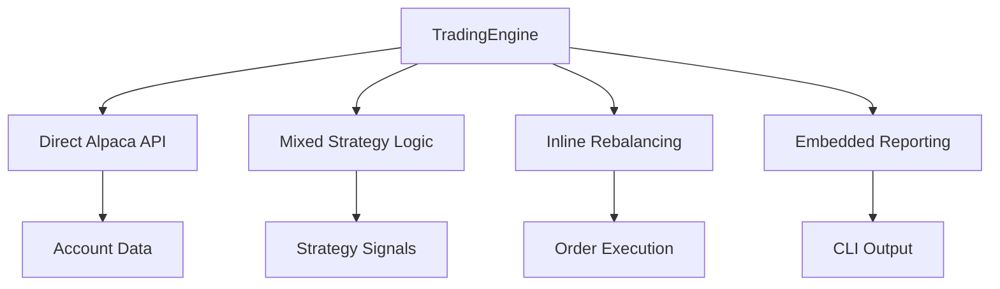
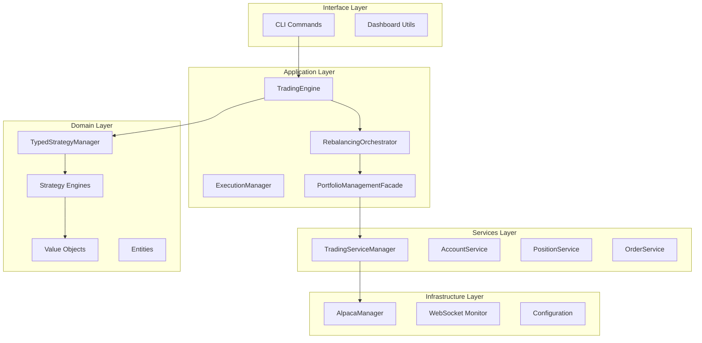
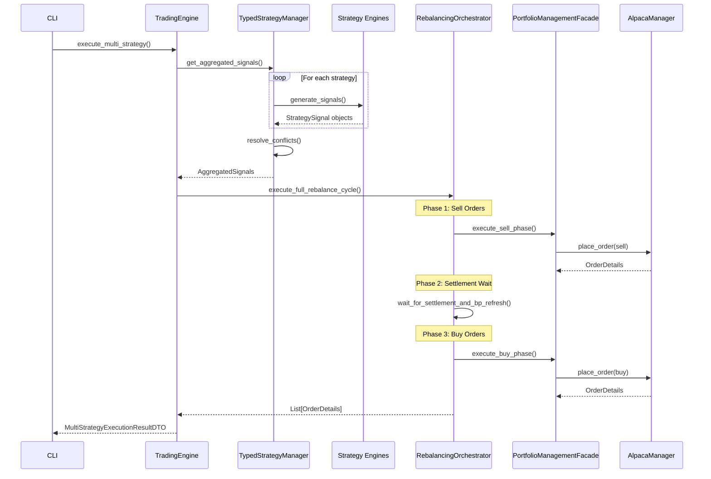
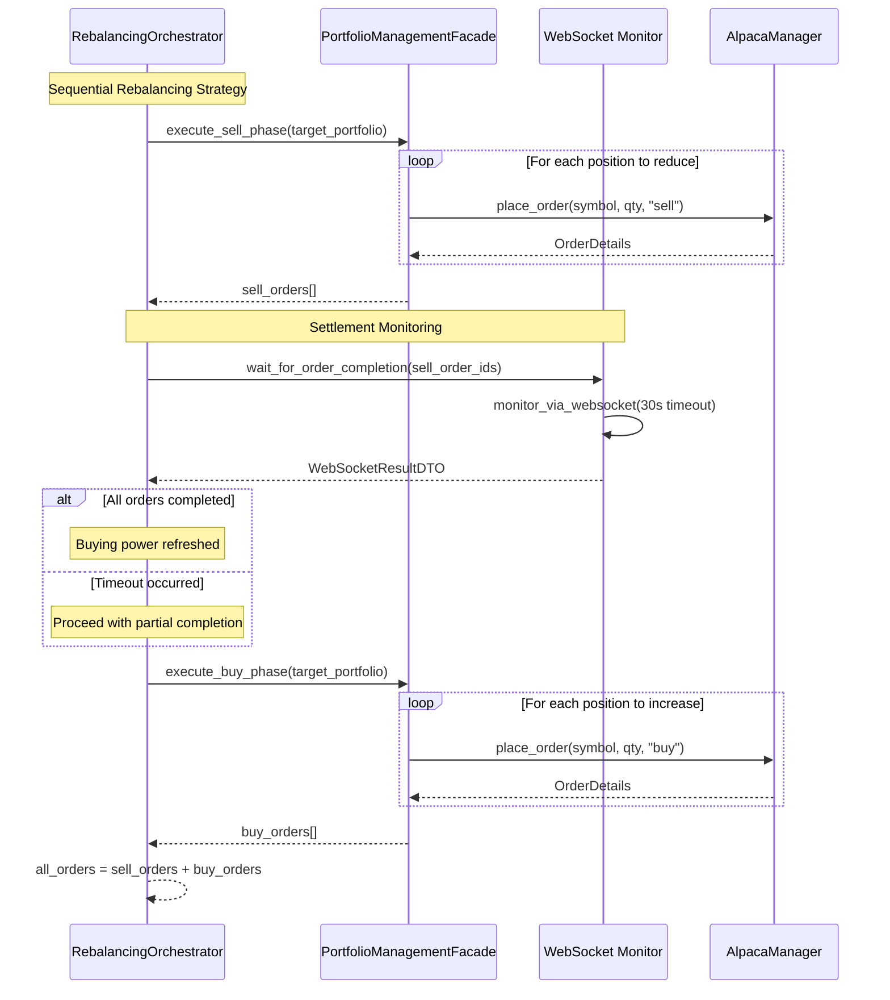
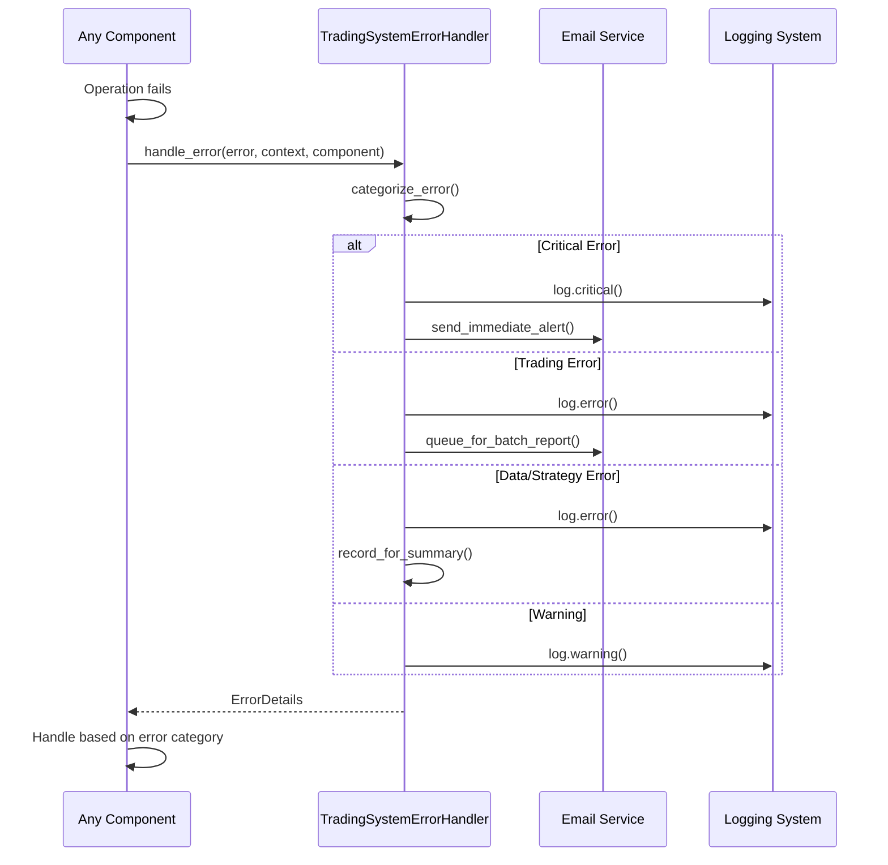

# Trading Engine Decomposition

> **Note**: This documentation is created for the alchemiser-quant.wiki repository. It should be moved to the wiki when the wiki repository is available.

## Overview

The Trading Engine Decomposition represents a comprehensive refactoring of The Alchemiser's trading system from a monolithic 1.4k-line orchestrator to a modular, Domain-Driven Design (DDD) architecture. This transformation enables better separation of concerns, improved testability, and enhanced maintainability while supporting multi-strategy execution with sophisticated portfolio rebalancing.

## Prior State (Before Refactoring)

### Legacy Architecture Challenges

The original `application/trading/trading_engine.py` suffered from several architectural issues:

- **Mixed Responsibilities**: Combined orchestration, infrastructure concerns, and reporting in a single file
- **Tight Coupling**: Direct dependencies on external adapters without abstraction layers
- **Limited Testability**: Difficult to unit test due to integrated concerns
- **Type Safety Issues**: Lacked comprehensive type annotations and protocol-based design
- **Maintenance Complexity**: 1.4k lines of mixed concerns made changes risky and time-consuming

### Legacy Component Structure

```
TradingEngine (Legacy - 1,400+ lines)
├─ Account management (direct Alpaca calls)
├─ Position tracking (mixed with API concerns)
├─ Order execution (embedded in orchestration)
├─ Portfolio rebalancing (inline logic)
├─ Strategy coordination (basic delegation)
├─ Error handling (ad-hoc)
├─ Reporting (embedded)
└─ Configuration (mixed with business logic)
```

### Legacy Data Flow



## Target Architecture (After Decomposition)

### DDD-Based Layer Structure

The refactored architecture follows Domain-Driven Design principles with clear layer separation:

#### 1. Domain Layer (`the_alchemiser/domain/`)
- **Pure Business Logic**: Strategy engines, value objects, domain entities
- **Framework-Free**: No external dependencies or infrastructure concerns
- **Core Components**:
  - `TypedStrategyManager`: Multi-strategy coordination
  - Strategy engines (Nuclear, TECL, KLM)
  - Value objects (`StrategySignal`, `Confidence`, `Symbol`, etc.)
  - Domain entities (`Order`, `Position`, `Account`)

#### 2. Application Layer (`the_alchemiser/application/`)
- **Use Case Orchestration**: Coordinates domain services and infrastructure
- **Core Components**:
  - `TradingEngine`: Main orchestrator (now 600 lines, focused)
  - `RebalancingOrchestrator`: Sequential SELL→settle→BUY execution
  - `ExecutionManager`: Smart order execution with market impact analysis
  - `PortfolioManagementFacade`: Portfolio operations facade

#### 3. Services Layer (`the_alchemiser/services/`)
- **Business Logic Services**: Enhanced services with rich functionality
- **Core Components**:
  - `TradingServiceManager`: Unified trading operations facade
  - `AccountService`: Account information and metrics
  - `PositionService`: Position tracking and analytics
  - `OrderService`: Order placement and monitoring

#### 4. Infrastructure Layer (`the_alchemiser/infrastructure/`)
- **External Integrations**: API clients, WebSocket connections, data providers
- **Core Components**:
  - `AlpacaManager`: Repository implementation for all Alpaca operations
  - WebSocket monitoring for order completion
  - Configuration management
  - Secrets management

#### 5. Interface Layer (`the_alchemiser/interface/`)
- **User Interfaces**: CLI, notifications, dashboard utilities
- **Core Components**:
  - Rich CLI with Typer framework
  - Signal analysis and display utilities
  - Dashboard formatting and visualization

## Module Boundaries and Responsibilities

### Core Module Mapping

| Component | Location | Responsibility | Dependencies |
|-----------|----------|----------------|-------------|
| **TradingEngine** | `application/trading/engine_service.py` | Main orchestration, multi-strategy coordination | Domain services, application orchestrators |
| **RebalancingOrchestrator** | `application/portfolio/rebalancing_orchestrator.py` | Sequential portfolio rebalancing with settlement timing | PortfolioManagementFacade, WebSocket monitoring |
| **TypedStrategyManager** | `domain/strategies/typed_strategy_manager.py` | Strategy signal aggregation and conflict resolution | MarketDataPort, strategy engines |
| **TradingServiceManager** | `services/trading/trading_service_manager.py` | Unified facade for all trading operations | Repository implementations |
| **PortfolioManagementFacade** | `application/portfolio/services/portfolio_management_facade.py` | Portfolio operations facade | Order services, position services |
| **TradingSystemErrorHandler** | `services/errors/handler.py` | Centralized error handling and categorization | Email notifications, logging |

### Boundary Enforcement



## Sequence Flows

### Multi-Strategy Execution Flow



### Portfolio Rebalancing Sequence (SELL→settle→BUY)



### Error Handling Flow



## Error Handling Patterns

### Error Categorization System

The refactored architecture implements a comprehensive error handling system with the `TradingSystemErrorHandler`:

#### Error Categories

1. **CRITICAL**: System-level failures requiring immediate attention
   - Trading client connection failures
   - Authentication errors
   - Configuration corruption

2. **TRADING**: Trading operation failures
   - Order rejection
   - Insufficient buying power
   - Market closure during execution

3. **DATA**: Market data and calculation errors
   - Missing price data
   - Indicator calculation failures
   - Historical data unavailability

4. **STRATEGY**: Strategy execution errors
   - Signal generation failures
   - Strategy timeout
   - Invalid strategy parameters

5. **CONFIGURATION**: Setup and configuration issues
   - Missing environment variables
   - Invalid API credentials
   - Malformed configuration files

6. **NOTIFICATION**: Email and alert system issues
   - SMTP failures
   - Notification delivery problems

7. **WARNING**: Non-critical issues requiring monitoring
   - Performance degradation
   - Data quality issues
   - Minor configuration problems

### Error Handling Implementation

```python
# Example from TradingEngine
from the_alchemiser.services.errors.handler import TradingSystemErrorHandler

class TradingEngine:
    def __init__(self):
        self.error_handler = TradingSystemErrorHandler()
    
    def execute_multi_strategy(self) -> MultiStrategyExecutionResultDTO:
        try:
            # Strategy execution logic
            result = self._multi_strategy_executor.execute_multi_strategy()
            return result
        except (StrategyExecutionError, TradingClientError) as e:
            error_details = self.error_handler.handle_error(
                error=e,
                component="TradingEngine.execute_multi_strategy",
                context="multi_strategy_execution",
                additional_data={"strategy_count": len(self.strategy_allocations)}
            )
            
            # Return structured error response
            return MultiStrategyExecutionResultDTO(
                success=False,
                error_message=str(e),
                error_category=error_details.category.value
            )
```

## Typed Mapping Strategy

### Domain-to-DTO Mapping

The refactored architecture implements a comprehensive mapping strategy between domain objects and Data Transfer Objects (DTOs):

#### Mapping Layers

1. **Domain → Application DTOs**: Located in `application/mapping/`
   - `account_mapping.py`: Account information transformations
   - `order_mapping.py`: Order entity mappings
   - `position_mapping.py`: Position data transformations
   - `strategies.py`: Strategy signal mappings

2. **Application → Interface DTOs**: Located in `interfaces/schemas/`
   - Pydantic-based DTOs for API boundaries
   - Type-safe serialization and validation
   - Rich error reporting and validation

#### Key Mapping Patterns

```python
# Strategy Signal Mapping (application/mapping/strategies.py)
def typed_signal_to_display_dto(signal: StrategySignal) -> StrategySignalDisplayDTO:
    """Convert typed domain StrategySignal to display DTO."""
    return StrategySignalDisplayDTO(
        symbol=signal.symbol.value,
        signal=signal.signal_type.value,
        confidence=float(signal.confidence.value),
        target_allocation=float(signal.target_allocation.value),
        current_allocation=float(signal.current_allocation.value) if signal.current_allocation else 0.0,
        reasoning=signal.reasoning,
        timestamp=signal.timestamp.isoformat(),
        strategy_type=signal.strategy_type.value,
        metadata=signal.metadata or {}
    )

# Account Mapping (application/mapping/account_mapping.py)
def account_summary_to_typed(account_dict: AccountInfo) -> AccountSummaryTyped:
    """Convert AccountInfo dict to typed domain object."""
    return AccountSummaryTyped(
        account_id=Identifier(account_dict["account_id"]),
        buying_power=Money(Decimal(str(account_dict["buying_power"]))),
        cash=Money(Decimal(str(account_dict["cash"]))),
        portfolio_value=Money(Decimal(str(account_dict["portfolio_value"]))),
        day_trade_count=account_dict["day_trade_count"],
        # ... additional fields
    )
```

## Code Locations and References

### Core Components

| Component | File Path | Key Methods | Tests |
|-----------|-----------|-------------|-------|
| **TradingEngine** | [`application/trading/engine_service.py`](the_alchemiser/application/trading/engine_service.py) | `execute_multi_strategy()`, `get_multi_strategy_performance_report()` | `tests/application/trading/` |
| **RebalancingOrchestrator** | [`application/portfolio/rebalancing_orchestrator.py`](the_alchemiser/application/portfolio/rebalancing_orchestrator.py) | `execute_full_rebalance_cycle()`, `wait_for_settlement_and_bp_refresh()` | `tests/application/portfolio/` |
| **TypedStrategyManager** | [`domain/strategies/typed_strategy_manager.py`](the_alchemiser/domain/strategies/typed_strategy_manager.py) | `get_aggregated_signals()`, `resolve_conflicts()` | `tests/domain/strategies/` |
| **TradingServiceManager** | [`services/trading/trading_service_manager.py`](the_alchemiser/services/trading/trading_service_manager.py) | `execute_smart_order()`, `get_portfolio_value()` | `tests/services/trading/` |
| **TradingSystemErrorHandler** | [`services/errors/handler.py`](the_alchemiser/services/errors/handler.py) | `handle_error()`, `generate_error_report()` | `tests/services/errors/` |

### Related Documentation

- **Refactor Plan**: [`docs/refactors/trading_engine_refactor_plan.md`](docs/refactors/trading_engine_refactor_plan.md)
- **Before/After Mapping**: [`docs/refactors/trading_engine_before_after.md`](docs/refactors/trading_engine_before_after.md)
- **Component Inventory**: [`docs/refactors/component_inventory.md`](docs/refactors/component_inventory.md)
- **DDD Modernization Plan**: [`docs/ddd-modernization-plan.md`](docs/ddd-modernization-plan.md)

### Strategy Engines

| Strategy | Implementation | Domain Objects | Description |
|----------|----------------|----------------|-------------|
| **Nuclear** | [`domain/strategies/nuclear_typed_engine.py`](the_alchemiser/domain/strategies/nuclear_typed_engine.py) | `StrategySignal`, `Confidence` | Sector rotation based on momentum |
| **TECL** | [`domain/strategies/tecl_strategy_engine.py`](the_alchemiser/domain/strategies/tecl_strategy_engine.py) | `StrategySignal`, `Confidence` | Volatility-based position sizing |
| **KLM** | [`domain/strategies/typed_klm_ensemble_engine.py`](the_alchemiser/domain/strategies/typed_klm_ensemble_engine.py) | `StrategySignal`, `Confidence` | Machine learning ensemble |

### Value Objects and Entities

| Category | Location | Key Objects |
|----------|----------|-------------|
| **Shared Kernel** | [`domain/shared_kernel/value_objects/`](the_alchemiser/domain/shared_kernel/value_objects/) | `Money`, `Percentage`, `Identifier` |
| **Trading Domain** | [`domain/trading/value_objects/`](the_alchemiser/domain/trading/value_objects/) | `Symbol`, `Quantity`, `OrderStatus` |
| **Trading Entities** | [`domain/trading/entities/`](the_alchemiser/domain/trading/entities/) | `Order`, `Position`, `Account` |
| **Strategy Objects** | [`domain/strategies/value_objects/`](the_alchemiser/domain/strategies/value_objects/) | `StrategySignal`, `Confidence`, `Alert` |

## Architecture Benefits

### Improved Separation of Concerns

1. **Domain Purity**: Business logic isolated from infrastructure concerns
2. **Testability**: Each layer can be tested independently with mocks
3. **Type Safety**: Comprehensive type annotations and protocol-based design
4. **Maintainability**: Clear module boundaries and focused responsibilities

### Enhanced Error Handling

1. **Centralized**: All errors flow through `TradingSystemErrorHandler`
2. **Categorized**: Structured error classification for appropriate responses
3. **Observable**: Comprehensive logging and email notifications
4. **Recoverable**: Graceful degradation and error recovery patterns

### Scalable Strategy System

1. **Pluggable**: New strategies implement `StrategyEngine` protocol
2. **Composable**: Multiple strategies can run simultaneously
3. **Conflict Resolution**: Automated conflict resolution between strategies
4. **Type-Safe**: All strategy signals are structured domain objects

### Robust Portfolio Management

1. **Sequential Execution**: SELL→settle→BUY prevents buying power issues
2. **Settlement Monitoring**: WebSocket-based order completion tracking
3. **Partial Completion**: Graceful handling of partial order fills
4. **Risk Management**: Built-in position sizing and allocation controls

## Design Principles

### Domain-Driven Design (DDD)

- **Ubiquitous Language**: Consistent terminology across all layers
- **Bounded Contexts**: Clear boundaries between trading, portfolio, and strategy domains
- **Value Objects**: Immutable objects for money, percentages, and identifiers
- **Entities**: Mutable objects with identity (orders, positions, accounts)

### Dependency Inversion

- **Protocol-Based**: Interfaces defined as protocols for flexibility
- **Dependency Injection**: Components receive dependencies through constructors
- **Repository Pattern**: Data access abstracted through repository interfaces

### Single Responsibility

- **Focused Classes**: Each class has a single, well-defined responsibility
- **Composed Behavior**: Complex operations built from simple, focused components
- **Layer Separation**: Clear separation between orchestration, business logic, and infrastructure

### Open/Closed Principle

- **Strategy Extension**: New strategies can be added without modifying existing code
- **Service Extension**: New services can be added through dependency injection
- **Protocol Implementation**: New implementations can be swapped without changing clients

## Migration Status

### Completed Refactors

- ✅ **TradingEngine Extraction**: Moved from `trading/trading_engine.py` to `application/trading/engine_service.py`
- ✅ **No Legacy Fallback Policy**: Removed compatibility wrappers
- ✅ **Typed Strategy Manager**: Implemented protocol-based strategy coordination
- ✅ **Portfolio Rebalancing**: Extracted to dedicated orchestrator with settlement timing
- ✅ **Error Handling**: Centralized error management with categorization
- ✅ **Service Facades**: Implemented `TradingServiceManager` for unified operations

### In Progress

- 🔄 **Domain Services Migration**: Ongoing migration of domain services to pure domain layer
- 🔄 **Protocol Adoption**: Gradual replacement of direct adapter imports with protocol-based dependencies
- 🔄 **Type Strengthening**: Comprehensive type annotation improvements across all layers

### Future Enhancements

- 📋 **Complete DDD Migration**: Full separation of domain logic from infrastructure
- 📋 **Enhanced Monitoring**: Real-time performance metrics and alerting
- 📋 **Strategy Backtesting**: Historical performance analysis framework
- 📋 **Advanced Risk Management**: Dynamic position sizing and risk controls

---

*This documentation represents the current state of the Trading Engine Decomposition as of the latest refactoring phase. For updates and additional details, refer to the linked code locations and related documentation.*