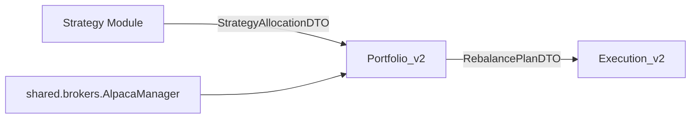

# Portfolio_v2 Rebuild Plan

## Executive summary

The current portfolio module is needlessly complex and leaks concerns. Portfolio_v2 replaces it with a minimal, DTO-first module that:

- Consumes a StrategyAllocationDTO (from shared.dto)
- Uses shared Alpaca capabilities for current positions/prices
- Produces a clean RebalancePlanDTO (from shared.dto) with BUY/SELL/HOLD items
- Does no order placement, execution hinting, or analytics

Outcome: a deterministic, ~200 LOC planning core that cleanly bridges strategy → portfolio → execution.

## Problem statement

### Current issues

1. Mixed concerns: rebalancing logic intertwined with analytics and (implicit) execution hints
2. Architectural bleed: broker specifics, market data, and state mutations inside portfolio
3. No single authoritative output: downstream modules second-guess trade intent
4. Performance and complexity: multiple passes and remote calls inside inner loops
5. Fragile integration: ambiguous contracts between strategy/portfolio/execution

### Root cause

Lack of a crisp contract and boundaries. Portfolio should compute a plan, not touch execution or recalc strategy logic.

## Core design principle

- Inputs: StrategyAllocationDTO (weights and constraints) + current snapshot (positions, prices, cash)
- Output: RebalancePlanDTO containing BUY/SELL/HOLD items and trade_amounts (Decimal)
- No side effects; no cross-module state; single pass O(n) over symbols

## Architecture vision



- Dependencies: portfolio_v2 → shared only (dto, types, brokers, config)
- Isolation: no imports from strategy/ or execution/
- Deterministic: same inputs → same plan

## New module structure

```text
portfolio_v2/
├── __init__.py
├── core/
│   ├── planner.py                # RebalancePlanCalculator (core)
│   ├── portfolio_service.py      # Thin orchestrator/facade
│   └── state_reader.py           # Builds PortfolioSnapshot via shared Alpaca
├── adapters/
│   └── alpaca_data_adapter.py    # Thin wrapper around shared.brokers.AlpacaManager
├── models/
│   ├── portfolio_snapshot.py     # Immutable snapshot (positions, prices, totals)
│   └── sizing_policy.py          # Rounding and thresholds
└── README.md                     # Scope, contract, examples
```

Each new Python file starts with:
"""Business Unit: portfolio | Status: current

Portfolio state management and rebalancing logic.
"""

## DTO contracts

- StrategyAllocationDTO (NEW in shared/dto):
  - fields: target_weights: dict[str, Decimal], portfolio_value: Decimal | None, correlation_id: str, as_of: datetime | None, constraints?: mapping
  - note: if portfolio_value is None, compute from snapshot
- RebalancePlanDTO (EXISTING in shared/dto):
  - items: list[RebalancePlanItemDTO] with symbol, trade_amount (Decimal dollars), action in {BUY, SELL, HOLD}, priority/meta

Expose new DTO via `shared/dto/__init__.py`. Money as Decimal only.

## Responsibilities

### Portfolio_v2 SHOULD

- Read current positions/prices/cash via shared Alpaca
- Compute target dollars per symbol from target weights
- Produce trade_amount = target_dollars - current_dollars
- Apply sizing/threshold policy and set action BUY/SELL/HOLD
- Emit RebalancePlanDTO only

### Portfolio_v2 SHOULD NOT

- Place or schedule orders, or suggest execution styles
- Recompute strategy logic; only translate weights → plan
- Import from strategy/ or execution/
- Maintain mutable global state or caches shared across modules

## Implementation plan

### Phase 1: Contracts and scaffolding (Week 1)

- Add `StrategyAllocationDTO` in `shared/dto/strategy_allocation_dto.py` with full typing
- Create `portfolio_v2/` skeleton and public API in `portfolio_v2/__init__.py`:
  - `from .core.portfolio_service import PortfolioServiceV2`
  - `from .core.planner import RebalancePlanCalculator`
- Ensure docstrings, mypy compliance, and ruff formatting

### Phase 2: Data access via shared Alpaca (Week 2)

- `adapters/alpaca_data_adapter.py`: thin wrapper over `shared.brokers.AlpacaManager`
  - `get_positions() -> dict[str, Decimal]` (qty by symbol)
  - `get_current_prices(symbols: list[str]) -> dict[str, Decimal]` (batch where possible)
  - `get_account_cash() -> Decimal`
- `core/state_reader.py`
  - `build_portfolio_snapshot(symbols: set[str] | None) -> PortfolioSnapshot`
  - Performs zero remote calls in loops; adapters do the IO

### Phase 3: Core planner (Week 3)

- `core/planner.py` with `class RebalancePlanCalculator:`
  - `build_plan(strategy: StrategyAllocationDTO, snapshot: PortfolioSnapshot, correlation_id: str) -> RebalancePlanDTO`
  - Steps:
    1. Normalize/validate weights; if sum not ~1 within epsilon → normalize or raise per config
    2. Determine portfolio_value (use strategy.portfolio_value or snapshot.total_value)
    3. target_dollars[s] = weight[s] * portfolio_value (Decimal)
    4. current_dollars[s] = qty[s] * price[s] (Decimal)
    5. trade_amount = target_dollars - current_dollars (Decimal)
    6. action = BUY if trade_amount > threshold; SELL if < -threshold; else HOLD
    7. Apply `sizing_policy` for rounding/lot rules (documented)
  - Output RebalancePlanDTO with items ordered by descending notional or configurable priority

### Phase 4: Orchestration facade (Week 4)

- `core/portfolio_service.py` with `class PortfolioServiceV2:`
  - `create_rebalance_plan_dto(strategy: StrategyAllocationDTO, correlation_id: str) -> RebalancePlanDTO`
  - Flow:
    - snapshot = state_reader.build_portfolio_snapshot(symbols=strategy.target_weights.keys())
    - plan = planner.build_plan(strategy, snapshot, correlation_id)
    - return plan
  - Structured logging: `module="portfolio_v2.core.portfolio_service"`

### Phase 5: Integration and migration (Week 5)

- Trading engine feature toggle, e.g. `USE_PORTFOLIO_V2=true`
- Keep legacy portfolio in place; add `portfolio/README_DEPRECATED.md` with migration steps
- No imports to execution/strategy; only shared DTOs

### Phase 6: Validation (Week 6)

- Provide a minimal manual validation script (no test framework):

```python
# scripts/validate_portfolio_v2.py (manual)
from decimal import Decimal
from the_alchemiser.shared.dto.strategy_allocation_dto import StrategyAllocationDTO
from the_alchemiser.portfolio_v2.core.portfolio_service import PortfolioServiceV2

strategy = StrategyAllocationDTO(
    target_weights={"SPY": Decimal("0.6"), "QQQ": Decimal("0.4")},
    portfolio_value=None,
    correlation_id="demo-123",
    as_of=None,
)
svc = PortfolioServiceV2(...)
plan = svc.create_rebalance_plan_dto(strategy, correlation_id="demo-123")
print(plan)
```

- Paper checks: Decimal usage, rounding policy, reasonable notional sizes

### Phase 7: Hardening (Week 7)

- Typed exceptions: `PortfolioError`, `ConfigurationError` with metadata `module="portfolio_v2.core.planner"`
- Observability: correlation_id propagation, per-symbol deltas, summary lines
- Performance: O(n) with batched price fetch; no network in inner loops

## Algorithmic contract

- Inputs:
  - StrategyAllocationDTO: `{symbol -> Decimal weight}`, optional portfolio_value
  - PortfolioSnapshot: `positions {symbol -> Decimal qty}`, `prices {symbol -> Decimal}`, `cash: Decimal`, `total_value: Decimal`
- Output:
  - RebalancePlanDTO: items with `symbol`, `trade_amount: Decimal dollars`, `action in {BUY, SELL, HOLD}`
- Error modes:
  - Missing price/position → `PortfolioError`
  - Weight sum invalid → normalize or raise per config
- Success:
  - `sum(current_value + trades) ≈ target_value` within tolerance
  - No float arithmetic for money

## Edge cases

- New symbols: targets include symbols with zero current qty (BUY from zero)
- Deletions: held symbols not in targets (SELL to zero)
- Minimal notional threshold: skip micro trades
- Fractional vs whole-share policy: configurable in `sizing_policy`
- Illiquid/halted: mark HOLD with reason in metadata (future extension)

## Acceptance criteria

- Portfolio_v2 outputs a valid RebalancePlanDTO strictly from StrategyAllocationDTO + snapshot
- All financial math uses Decimal; non-financial float compares use `math.isclose`
- No imports from strategy/ or execution/
- Business unit docstrings present; mypy clean; ruff clean
- `BUSINESS_UNITS_REPORT.md` updated when adding/removing module files

## Constraints and rules

- Follow `.github/copilot-instructions.md`:
  - Module boundaries enforced (portfolio → shared only)
  - Typed exceptions and structured logging with module context
  - No tests added by AI agent; provide manual script only
  - Public API via `portfolio_v2.__init__`

## File-by-file sketch

- `portfolio_v2/core/planner.py`
  - `class RebalancePlanCalculator`
  - `build_plan(strategy: StrategyAllocationDTO, snapshot: PortfolioSnapshot, correlation_id: str) -> RebalancePlanDTO`
- `portfolio_v2/core/state_reader.py`
  - `class PortfolioStateReader`
  - `build_portfolio_snapshot(symbols: set[str] | None) -> PortfolioSnapshot`
- `portfolio_v2/core/portfolio_service.py`
  - `class PortfolioServiceV2`
  - `create_rebalance_plan_dto(strategy: StrategyAllocationDTO, correlation_id: str) -> RebalancePlanDTO`
- `portfolio_v2/adapters/alpaca_data_adapter.py`
  - Thin calls to `shared.brokers.AlpacaManager`: `get_positions`, `get_current_price(s)`, `get_account`
- `portfolio_v2/models/portfolio_snapshot.py`
  - `@dataclass(frozen=True)` with positions, prices, cash, total_value
- `shared/dto/strategy_allocation_dto.py` (NEW)
  - StrategyAllocationDTO as described; exposed via `shared/dto/__init__.py`

## Migration strategy

- Phase A: Add Portfolio_v2 alongside legacy; feature flag gating
- Phase B: Use Portfolio_v2 in paper flows; compare DTOs for sanity
- Phase C: Switch default to Portfolio_v2; keep legacy as deprecated
- Phase D: Remove legacy after stability window

## Success metrics

- Single-pass O(n) plan computation
- Deterministic plans given same snapshot and strategy DTO
- ≤ ~200 effective LOC for planner + service
- No execution leakage (imports or behavior)

## Risks and mitigations

- Price/position availability: build snapshot once per cycle; fail fast on missing data
- Rounding discrepancies: centralized `sizing_policy`; document rounding mode
- Weight sum drift: normalize with explicit tolerance and log

## Deprecation plan (legacy portfolio)

- Add `portfolio/README_DEPRECATED.md` with the following content:

```markdown
# DEPRECATED PORTFOLIO MODULE

This module is deprecated in favor of `portfolio_v2`.

Use:
```

```python
# OLD (deprecated)
from the_alchemiser.portfolio.service import PortfolioService

# NEW (recommended)
from the_alchemiser.portfolio_v2.core.portfolio_service import PortfolioServiceV2
```

Timeline:

- Phase 1: portfolio_v2 available alongside legacy
- Phase 2: default to portfolio_v2 behind feature flag
- Phase 3: remove legacy module after stability window

## Timeline

| Week | Phase                | Deliverables                                        |
|------|----------------------|-----------------------------------------------------|
| 1    | Contracts/Scaffold   | StrategyAllocationDTO, skeleton, public API         |
| 2    | Data Access          | Alpaca adapter + snapshot reader                     |
| 3    | Planner              | RebalancePlanCalculator, Decimal policies            |
| 4    | Orchestration        | PortfolioServiceV2 + logs                            |
| 5    | Integration/Migration| Engine toggle + legacy deprecation doc               |
| 6    | Validation           | Manual validation script + paper checks              |
| 7    | Hardening            | Errors, observability, perf pass                     |

## References

- `EXECUTION_MODULE_REBUILD_PLAN.md` (pattern to mirror)
- `shared/brokers/alpaca_manager.py` (existing broker integration)
- `shared/dto/rebalance_plan_dto.py` (target DTO)
- `.github/copilot-instructions.md` (module boundaries, Decimal policy, typing)
